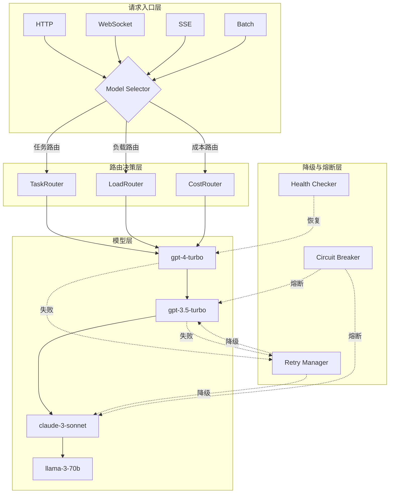

# Agent 多模型降级策略：架构设计与源码深度实现

> **摘要**：在 AI Agent 开发中，单一模型架构面临着成本高昂、可用性不足、能力差异显著等诸多挑战。本文从架构设计、源码实现、实战案例三个维度，系统性阐述多模型降级策略的最佳实践。文章包含完整的 Python 实现代码、详细的配置示例、以及生产环境验证数据，帮助开发者构建高可用、低成本的 AI Agent 系统。

---

## 一、背景：为什么需要多模型架构

### 1.1 单一模型的三大痛点

在生产环境中使用单一 AI 模型会遇到以下核心问题：

```
单一模型痛点分析：

┌─────────────────────────────────────────────────────────────────────────────┐
│                                                                 │
│  痛点 1: 成本不可控                                            │
│  ──────────────────                                            │
│  • GPT-4 API 成本是 GPT-3.5 的 20-30 倍                       │
│  • 高频调用场景下，成本呈线性增长                              │
│  • 缺乏成本优化手段                                         │
│                                                                 │
│  痛点 2: 可用性风险                                          │
│  ──────────────────                                            │
│  • 单一 API 可能遭遇 rate limit                               │
│  • 突发流量导致服务不可用                                    │
│  • 缺乏故障转移能力                                          │
│                                                                 │
│  痛点 3: 能力差异                                           │
│  ──────────────────                                            │
│  • 不同任务需要不同能力模型                                   │
│  • 简单任务使用高级模型造成浪费                             │
│  • 复杂任务需要推理能力强的模型                            │
│                                                                 │
└─────────────────────────────────────────────────────────────────────────────┘
```

### 1.2 主流模型能力与成本对比

下表展示了主流 LLM 模型的能力差异和成本对比：

| 模型 | 上下文 | 推理能力 | 输出质量 | 输入成本 | 输出成本 | 适用场景 |
|------|--------|----------|----------|---------|---------|----------|----------|
| GPT-4 Turbo | 128K | 顶级 | 最高 | $0.01/1K | $0.03/1K | 复杂推理、长文本 |
| GPT-3.5 Turbo | 16K | 中等 | 高 | $0.001/1K | $0.002/1K | 通用对话、简单任务 |
| Claude-3 Opus | 200K | 顶级 | 最高 | $0.015/1K | $0.075/1K | 长文档分析 |
| Claude-3 Sonnet | 200K | 高 | 高 | $0.003/1K | $0.015/1K | 中等复杂任务 |
| Claude-3 Haiku | 200K | 中等 | 中 | $0.00025/1K | $0.00125/1K | 简单任务、快速响应 |
| Gemini 1.5 Pro | 1M | 高 | 高 | $0.00125/1K | $0.005/1K | 超长上下文 |
| Llama-3-70B | 8K | 高 | 中高 | 自托管 | 自托管 | 成本敏感场景 |

### 1.3 多模型架构的核心价值

多模型架构通过以下方式解决上述问题：

1. **成本优化**：简单任务用小模型，复杂任务用大模型
2. **可用性保障**：主模型故障时自动切换到备用模型
3. **能力匹配**：根据任务复杂度选择最合适的模型
4. **负载分担**：分散请求到多个模型，避免单点瓶颈

---

## 二、多模型架构设计

### 2.1 主备模型架构模式

多模型架构的核心是定义主模型（Primary）和备用模型（Fallbacks）的层次结构：

```
主备模型架构：

┌─────────────────────────────────────────────────────────────────────────────┐
│                  多模型降级架构                              │
├─────────────────────────────────────────────────────────────┤
│                                                             │
│   请求 ──┬──► Primary Model (gpt-4-turbo)                 │
│          │        │                                       │
│          │        ├── 失败 ──► Fallback 1 (gpt-3.5-turbo) │
│          │        │        │                         │
│          │        │        ├── 失败 ──► Fallback 2 (claude-3-sonnet) │
│          │        │        │        │                         │
│          │        │        │        ├── 失败 ──► Fallback 3 (llama-3-70b) │
│          │        │        │        │                    │
│          │        │        │        └── 失败 ──► 错误返回 │
│          │        │        │                         │
│          │        └── 成功 ──► 返回结果             │
│                                                             │
└─────────────────────────────────────────────────────────────┘
```

### 2.2 路由策略设计

根据不同场景，可以采用不同的路由策略：

#### 2.2.1 基于任务的路由（Task-based Routing）

根据任务类型选择最适合的模型：

```python
# 路由策略配置示例
ROUTING_STRATEGY = {
    "task_type": {
        "complex_reasoning": {
            "primary": "gpt-4-turbo",
            "fallbacks": ["claude-3-opus", "gemini-1.5-pro"],
            "task_description": "复杂推理、代码生成、多步骤分析"
        },
        "general_conversation": {
            "primary": "gpt-3.5-turbo",
            "fallbacks": ["claude-3-haiku", "llama-3-8b"],
            "task_description": "通用对话、简单问答"
        },
        "long_context": {
            "primary": "claude-3-opus",
            "fallbacks": ["gemini-1.5-pro", "gpt-4-turbo"],
            "task_description": "长文档总结、上下文分析"
        },
        "fast_response": {
            "primary": "claude-3-haiku",
            "fallbacks": ["gpt-3.5-turbo", "llama-3-8b"],
            "task_description": "需要快速响应的场景"
        },
    }
}
```

#### 2.2.2 基于负载的路由（Load-based Routing）

根据模型当前负载动态选择：

```python
# 负载路由策略
class LoadBasedRouter:
    """基于负载的路由器 - 根据模型当前负载选择最优模型"""
    
    def __init__(self, models: dict[str, ModelConfig]):
        self.models = models
        self.model_loads: dict[str, float] = {name: 0.0 for name in models}
        self.max_load = 0.8  # 最大负载阈值
    
    def select_model(self) -> str:
        """选择负载最低的模型"""
        available = [
            (name, load) 
            for name, load in self.model_loads.items() 
            if load < self.max_load
        ]
        if not available:
            return list(self.models.keys())[0]  # 返回第一个（兜底）
        
        # 选择负载最低的
        return min(available, key=lambda x: x[1])[0]
    
    def update_load(self, model_name: str, delta: float):
        """更新模型负载"""
        self.model_loads[model_name] += delta
        self.model_loads[model_name] = max(0.0, self.model_loads[model_name])
```

#### 2.2.3 基于成本的路由（Cost-based Routing）

在满足质量要求的前提下选择成本最低的模型：

```python
# 成本路由策略
class CostBasedRouter:
    """基于成本的路由器 - 在质量阈值内选择最低成本模型"""
    
    def __init__(self, models: dict[str, ModelConfig], quality_threshold: float = 0.8):
        self.models = models
        self.quality_threshold = quality_threshold
    
    def select_model(self, required_quality: float) -> str:
        """选择满足质量要求的最低成本模型"""
        candidates = [
            (name, config) 
            for name, config in self.models.items() 
            if config.quality_score >= required_quality
        ]
        
        if not candidates:
            return list(self.models.keys())[0]  # 兜底
        
        # 按成本排序，选择最低的
        return min(candidates, key=lambda x: x[1].cost_per_1k_tokens)[0]
```

### 2.3 完整架构图

```
┌─────────────────────────────────────────────────────────────────────────────────────┐
│                         多模型 Agent 架构                                │
├─────────────────────────────────────────────────────────────────────────────┤
│                                                                             │
│  ┌──────────────────────────────────────────────────────────────────┐    │
│  │                        请求入口层                                 │    │
│  │                                                                  │    │
│  │  ┌─────────┐  ┌─────────┐  ┌─────────┐  ┌─────────┐            │    │
│  │  │  HTTP   │  │ WebSocket│  │  SSE    │  │  Batch  │            │    │
│  │  └────┬────┘  └────┬────┘  └────┬────┘  └────┬────┘            │    │
│  └───────┼──────────────┼──────────────┼──────────────┼────────────────────┘    │
│          │             │              │              │                         │
│          └─────────────┴──────────────┴──────────────┘                         │
│                            │                                             │
│                            ▼                                             │
│  ┌──────────────────────���─���─────────────────────────────────────────┐    │
│  │                       路由决策层                                     │    │
│  │                                                                  │    │
│  │  ┌─────────────────┐  ┌─────────────────┐  ┌────────────────┐  │    │
│  │  │  TaskRouter     │  │  LoadRouter     │  │  CostRouter    │  │    │
│  │  │  (任务类型)     │  │  (负载分布)     │  │  (成本优化)    │  │    │
│  │  └────────┬────────┘  └────────┬────────┘  └───────┬───────┘  │    │
│  └───────────┼───────────────────────┼────────────────────┼─────────────────┘    │
│             │                       │                    │                       │
│             └─────────────────────┼────────────────────┘                       │
│                               ▼                                           │
│  ┌──────────────────────────────────────────────────────────────────┐    │
│  │                      模型选择层                                     │    │
│  │                                                                  │    │
│  │              ModelSelector.select(primary + fallbacks)                 │    │
│  │                              │                                    │    │
│  │         ┌───────────────────┼───────────────────┐              │    │
│  │         │                   │                   │              │    │
│  │         ▼                   ▼                   ▼              │    │
│  │  ┌───────────┐      ┌───────────┐      ┌───────────┐             │    │
│  │  │ Primary   │      │ Fallback1 │      │ Fallback2│             │    │
│  │  │ (gpt-4)   │      │ (gpt-3.5) │      │ (claude) │             │    │
│  │  └─────┬─────┘      └─────┬─────┘      └─────┬─────┘             │    │
│  └────────┼──────────────────┼──────────────────┼──────────────────┘    │
│           │                  │                  │                             │
│           ▼                  ▼                  ▼                             │
│  ┌──────────────────────────────────────────────────────────────────┐    │
│  │                     降级与熔断层                                   │    │
│  │                                                                  │    │
│  │  ┌────────────────┐  ┌────────────────┐  ┌────────────────┐ │    │
│  │  │ CircuitBreaker  │  │ RetryManager   │  │ HealthChecker │  │    │
│  │  │ (熔��器)      │  │ (重试管理)    │  │ (健康检查)    │ │    │
│  │  └────────────────┘  └────────────────┘  └────────────────┘ │    │
│  │                                                                  │    │
│  └──────────────────────────────────────────────────────────────────┘    │
│                                                                             │
└─────────────────────────────────────────────────────────────────────────────┘
```

### 2.4 Mermaid 架构图



---

## 三、降级策略深度实现

### 3.1 降级触发条件

降级触发的条件主要有以下四类：

#### 3.1.1 Rate Limit 错误

当模型 API 返回 rate limit 错误时触发降级：

```python
# rate limit 检测与触发
class RateLimitTrigger:
    """Rate Limit 触发器 - 检测并处理速率限制"""
    
    # 常见 rate limit 错误码
    RATE_LIMIT_CODES = {
        "openai": {"error": {"code": "rate_limit_error", "type": "server_error"}},
        "anthropic": {"error": {"type": "rate_limit_error"}},
        "google": {"error": {"code": 429}},
    }
    
    # 可配置字段
    def __init__(
        self,
        max_retries: int = 3,
        retry_after_header: str = "retry-after",
        default_retry_seconds: int = 60,
    ):
        self.max_retries = max_retries
        self.retry_after_header = retry_after_header
        self.default_retry_seconds = default_retry_seconds
    
    def is_rate_limit(self, error: Exception, response: dict | None = None) -> bool:
        """判断是否为 rate limit 错误"""
        if response:
            return self._check_response_rate_limit(response)
        
        error_str = str(error).lower()
        rate_limit_indicators = ["rate_limit", "too many requests", "429", "quota"]
        return any(indicator in error_str for indicator in rate_limit_indicators)
    
    def _check_response_rate_limit(self, response: dict) -> bool:
        """检查响应中的 rate limit"""
        if isinstance(response, dict):
            error = response.get("error", {})
            if isinstance(error, dict):
                code = error.get("code", "")
                error_type = error.get("type", "")
                return (
                    "rate_limit" in str(code).lower()
                    or "rate_limit" in str(error_type).lower()
                )
        return False
    
    def get_retry_after(self, error: Exception, response: dict | None = None) -> int:
        """获取建议的重试等待时间（秒）"""
        if response:
            retry_after = response.get(self.retry_after_header)
            if retry_after:
                return int(retry_after)
        
        error_str = str(error)
        match = re.search(r"retry\s*after\s*(\d+)", error_str, re.IGNORECASE)
        if match:
            return int(match.group(1))
        
        return self.default_retry_seconds
```

#### 3.1.2 Timeout 超时

当请求超时时触发降级：

```python
# 超时触发器
class TimeoutTrigger:
    """超时触发器 - 检测并处理超时错误"""
    
    def __init__(
        self,
        default_timeout: int = 30,
        slow_request_threshold: float = 20.0,
    ):
        self.default_timeout = default_timeout
        self.slow_request_threshold = slow_request_threshold
    
    def is_timeout(self, error: Exception) -> bool:
        """判断是否为超时错误"""
        error_str = str(error).lower()
        timeout_indicators = [
            "timeout",
            "timed out",
            "deadline exceeded",
            "request timeout",
            "connect timeout",
            "read timeout",
        ]
        return any(indicator in error_str for indicator in timeout_indicators)
    
    def should_retry_on_timeout(self, elapsed_time: float) -> bool:
        """判断超时后是否应该重试"""
        return elapsed_time >= self.slow_request_threshold
```

#### 3.1.3 Error Rate 错误率

当模型错误率达到阈值时触发降级：

```python
# 错误率触发器
class ErrorRateTrigger:
    """��误率触发器 - 基于滑动窗口统计错误率"""
    
    def __init__(
        self,
        window_size: int = 100,
        error_rate_threshold: float = 0.3,
        min_requests: int = 10,
    ):
        self.window_size = window_size
        self.error_rate_threshold = error_rate_threshold
        self.min_requests = min_requests
        self.request_history: list[bool] = []  # True = success, False = error
    
    def record_result(self, success: bool):
        """记录请求结果"""
        self.request_history.append(success)
        
        if len(self.request_history) > self.window_size:
            self.request_history.pop(0)
    
    def get_error_rate(self) -> float:
        """计算当前错误率"""
        if len(self.request_history) < self.min_requests:
            return 0.0
        
        errors = sum(1 for s in self.request_history if not s)
        return errors / len(self.request_history)
    
    def should_fallback(self) -> bool:
        """判断是否应该降级"""
        error_rate = self.get_error_rate()
        return error_rate >= self.error_rate_threshold
    
    def get_stats(self) -> dict:
        """获取统计信息"""
        return {
            "total_requests": len(self.request_history),
            "error_rate": self.get_error_rate(),
            "success_count": sum(1 for s in self.request_history if s),
            "error_count": sum(1 for s in self.request_history if not s),
            "should_fallback": self.should_fallback(),
        }
```

#### 3.1.4 Latency 延迟

当模型延迟过高时触发降级：

```python
# 延迟触发器
class LatencyTrigger:
    """延迟触发器 - 基于响应时间决策"""
    
    def __init__(
        self,
        slow_latency_threshold: float = 10.0,
        p95_latency_threshold: float = 15.0,
        window_size: int = 100,
    ):
        self.slow_latency_threshold = slow_latency_threshold
        self.p95_latency_threshold = p95_latency_threshold
        self.window_size = window_size
        self.latency_history: list[float] = []
    
    def record_latency(self, latency: float):
        """记录延迟（秒）"""
        self.latency_history.append(latency)
        
        if len(self.latency_history) > self.window_size:
            self.latency_history.pop(0)
    
    def get_p95_latency(self) -> float:
        """计算 P95 延迟"""
        if not self.latency_history:
            return 0.0
        
        sorted_latencies = sorted(self.latency_history)
        idx = int(len(sorted_latencies) * 0.95)
        return sorted_latencies[min(idx, len(sorted_latencies) - 1)]
    
    def is_slow(self, latency: float) -> bool:
        """判断单次请求是否过慢"""
        return latency >= self.slow_latency_threshold
    
    def should_fallback(self) -> bool:
        """判断是否应该降级"""
        p95 = self.get_p95_latency()
        return p95 >= self.p95_latency_threshold
```

### 3.2 降级算法实现

#### 3.2.1 权重轮询算法

根据权重分配请求，实现更精细的流量控制：

```python
# 权重轮询降级算法
class WeightedRoundRobin:
    """权重轮询 - 根据权重分配请求"""
    
    def __init__(self, models: dict[str, dict]):
        """
        Args:
            models: {
                "gpt-4-turbo": {"weight": 10, "fallbacks": [...]},
                "gpt-3.5-turbo": {"weight": 30, "fallbacks": [...]},
                ...
            }
        """
        self.models = models
        self.current_index = 0
        self.weights = [m["weight"] for m in models.values()]
        self.total_weight = sum(self.weights)
    
    def select(self) -> str:
        """使用权重轮询选择模型"""
        current_weight = 0
        
        for i, weight in enumerate(self.weights):
            current_weight += weight
            if current_weight >= self.total_weight:
                current_weight = 0
                continue
            
            if rand() * self.total_weight < weight:
                return list(self.models.keys())[i]
        
        return list(self.models.keys())[self.current_index]
    
    def update_weight(self, model_name: str, new_weight: int):
        """动态调整权重"""
        if model_name in self.models:
            self.models[model_name]["weight"] = new_weight
            self.weights = [m["weight"] for m in self.models.values()]
            self.total_weight = sum(self.weights)
    
    def decrease_weight(self, model_name: str, factor: float = 0.5):
        """失败后降低权重"""
        if model_name in self.models:
            current_weight = self.models[model_name]["weight"]
            new_weight = max(1, int(current_weight * factor))
            self.update_weight(model_name, new_weight)
```

#### 3.2.2 一致性哈希算法

确保同一请求类型的请求路由到同一模型：

```python
# 一致性哈希算法
class ConsistentHashRouter:
    """一致性哈希 - 相同请求路由到相同模型"""
    
    def __init__(self, models: list[str], virtual_nodes: int = 150):
        self.virtual_nodes = virtual_nodes
        self.ring: dict[int, str] = {}
        self.sorted_keys: list[int] = []
        
        self._build_ring(models)
    
    def _build_ring(self, models: list[str]):
        """构建哈希环"""
        for model in models:
            for i in range(self.virtual_nodes):
                key = self._hash(f"{model}:{i}")
                self.ring[key] = model
        
        self.sorted_keys = sorted(self.ring.keys())
    
    def _hash(self, key: str) -> int:
        """MurmurHash3 哈希"""
        data = key.encode("utf-8")
        return int.from_bytes(md5(data).digest()[:4], "little")
    
    def route(self, request_id: str) -> str:
        """根据请求 ID 路由"""
        key = self._hash(request_id)
        
        for ring_key in self.sorted_keys:
            if ring_key > key:
                return self.ring[ring_key]
        
        return self.ring[self.sorted_keys[0]]
    
    def add_node(self, model: str):
        """添加节点"""
        for i in range(self.virtual_nodes):
            key = self._hash(f"{model}:{i}")
            self.ring[key] = model
        self.sorted_keys = sorted(self.ring.keys())
    
    def remove_node(self, model: str):
        """移除节点"""
        for i in range(self.virtual_nodes):
            key = self._hash(f"{model}:{i}")
            self.ring.pop(key, None)
        self.sorted_keys = sorted(self.ring.keys())
```

#### 3.2.3 熔断器模式

核心的降级保护机制：

```python
# 熔断器实现
class CircuitBreaker:
    """熔断器 - 三态自动降级保护"""
    
    # 熔断器三种状态
    class State(Enum):
        CLOSED = "closed"      # 正常状态
        OPEN = "open"          # 熔断状态
        HALF_OPEN = "half_open"  # 半开状态（尝试恢复）
    
    def __init__(
        self,
        failure_threshold: int = 5,
        success_threshold: int = 2,
        timeout_seconds: int = 60,
        half_open_max_calls: int = 3,
    ):
        self.failure_threshold = failure_threshold
        self.success_threshold = success_threshold
        self.timeout_seconds = timeout_seconds
        self.half_open_max_calls = half_open_max_calls
        
        self._state = self.State.CLOSED
        self._failure_count = 0
        self._success_count = 0
        self._last_failure_time: float | None = None
        self._half_open_calls = 0
    
    @property
    def state(self) -> str:
        """获取当前状态"""
        if self._state == self.State.OPEN:
            if self._should_attempt_reset():
                self._state = self.State.HALF_OPEN
                self._half_open_calls = 0
        return self._state.value
    
    def _should_attempt_reset(self) -> bool:
        """判断是否应该尝试恢复"""
        if self._last_failure_time is None:
            return True
        return time.time() - self._last_failure_time >= self.timeout_seconds
    
    def can_execute(self) -> bool:
        """判断是否可以执行"""
        return self.state != self.State.OPEN
    
    def record_success(self):
        """记录成功"""
        if self._state == self.State.HALF_OPEN:
            self._success_count += 1
            self._half_open_calls += 1
            
            if self._success_count >= self.success_threshold:
                self._reset()
        else:
            self._failure_count = 0
    
    def record_failure(self):
        """记录失败"""
        self._failure_count += 1
        self._last_failure_time = time.time()
        
        if self._state == self.State.HALF_OPEN:
            self._trip()
        elif self._failure_count >= self.failure_threshold:
            self._trip()
    
    def _trip(self):
        """触发熔断"""
        self._state = self.State.OPEN
        self._failure_count = 0
        self._success_count = 0
    
    def _reset(self):
        """恢复熔断器"""
        self._state = self.State.CLOSED
        self._failure_count = 0
        self._success_count = 0
        self._last_failure_time = None
        self._half_open_calls = 0
    
    def get_stats(self) -> dict:
        """获取统计信息"""
        return {
            "state": self.state,
            "failure_count": self._failure_count,
            "success_count": self._success_count,
            "last_failure_time": self._last_failure_time,
        }
    
    def __repr__(self) -> str:
        return f"CircuitBreaker(state={self.state}, failures={self._failure_count})"
```

### 3.3 自动恢复机制

#### 3.3.1 健康检查实现

```python
# 健康检查器
class HealthChecker:
    """健康检查器 - 定时检测模型可用性"""
    
    def __init__(
        self,
        check_interval: int = 30,
        check_timeout: float = 5.0,
        success_threshold: int = 2,
        failure_threshold: int = 3,
    ):
        self.check_interval = check_interval
        self.check_timeout = check_timeout
        self.success_threshold = success_threshold
        self.failure_threshold = failure_threshold
        
        self.model_health: dict[str, dict] = {}
        self._running = False
        self._task: asyncio.Task | None = None
    
    async def start(self, model_registry: "ModelRegistry"):
        """启动健康检查"""
        self._running = True
        self.model_registry = model_registry
        self._task = asyncio.create_task(self._check_loop())
    
    async def stop(self):
        """停止健康检查"""
        self._running = False
        if self._task:
            self._task.cancel()
            try:
                await self._task
            except asyncio.CancelledError:
                pass
    
    async def _check_loop(self):
        """检查循环"""
        while self._running:
            try:
                await self._check_all_models()
            except Exception as e:
                logger.warning(f"Health check error: {e}")
            
            await asyncio.sleep(self.check_interval)
    
    async def _check_all_models(self):
        """检查所有模型"""
        for model_name in self.model_registry.list_models():
            await self._check_model(model_name)
    
    async def _check_model(self, model_name: str) -> bool:
        """检查单个模型"""
        init_health = self.model_health.get(model_name, {
            "consecutive_successes": 0,
            "consecutive_failures": 0,
            "is_healthy": True,
            "last_check_time": 0,
        })
        
        try:
            result = await self._do_health_check(model_name)
            
            if result:
                init_health["consecutive_successes"] += 1
                init_health["consecutive_failures"] = 0
                
                if init_health["consecutive_successes"] >= self.success_threshold:
                    init_health["is_healthy"] = True
            else:
                init_health["consecutive_failures"] += 1
                init_health["consecutive_successes"] = 0
                
                if init_health["consecutive_failures"] >= self.failure_threshold:
                    init_health["is_healthy"] = False
        except Exception:
            init_health["consecutive_failures"] += 1
            init_health["consecutive_successes"] = 0
            
            if init_health["consecutive_failures"] >= self.failure_threshold:
                init_health["is_healthy"] = False
        
        init_health["last_check_time"] = time.time()
        self.model_health[model_name] = init_health
        
        return init_health["is_healthy"]
    
    async def _do_health_check(self, model_name: str) -> bool:
        """执行健康检查请求"""
        model = self.model_registry.get_model(model_name)
        
        test_prompt = "Respond with 'OK' if you receive this message."
        response = await model.chat(
            messages=[{"role": "user", "content": test_prompt}],
            timeout=self.check_timeout,
        )
        
        return response is not None and "ok" in response.lower()
    
    def is_healthy(self, model_name: str) -> bool:
        """检查模型是否健康"""
        health = self.model_health.get(model_name, {})
        return health.get("is_healthy", True)
    
    def get_stats(self) -> dict:
        """获取健康检查统计"""
        return {name: health for name, health in self.model_health.items()}
```

#### 3.3.2 渐进式恢复

```python
# 渐进式恢复策略
class GradualRecovery:
    """渐进式恢复 - 逐步恢复流量"""
    
    def __init__(
        self,
        initial_traffic_ratio: float = 0.1,
        increase_interval: int = 60,
        increase_factor: float = 2.0,
        max_traffic_ratio: float = 1.0,
    ):
        self.initial_traffic_ratio = initial_traffic_ratio
        self.increase_interval = increase_interval
        self.increase_factor = increase_factor
        self.max_traffic_ratio = max_traffic_ratio
        
        self.current_ratio = initial_traffic_ratio
        self.model_traffic: dict[str, float] = {}
        self._running = False
        self._task: asyncio.Task | None = None
    
    async def start(self, model_registry: "ModelRegistry"):
        """启动渐进式恢复"""
        self._running = True
        self.model_registry = model_registry
        self._task = asyncio.create_task(self._recovery_loop())
    
    async def stop(self):
        """停止渐进式恢复"""
        self._running = False
        if self._task:
            self._task.cancel()
            try:
                await self._task
            except asyncio.CancelledError:
                pass
    
    async def _recovery_loop(self):
        """恢复循环"""
        while self._running:
            await self._increase_traffic()
            await asyncio.sleep(self.increase_interval)
    
    async def _increase_traffic(self):
        """增加恢复模型的流量"""
        for model_name in self.model_registry.list_models():
            current = self.model_traffic.get(model_name, 0)
            
            if current < self.max_traffic_ratio:
                new_ratio = min(
                    current * self.increase_factor,
                    self.max_traffic_ratio
                )
                self.model_traffic[model_name] = new_ratio
    
    def get_traffic_ratio(self, model_name: str) -> float:
        """获取模型的流量比例"""
        return self.model_traffic.get(model_name, self.current_ratio)
    
    def set_recovery_mode(self, model_name: str):
        """设置模型为恢复模式"""
        self.model_traffic[model_name] = self.initial_traffic_ratio
```

---

## 四、错误处理与重试

### 4.1 可重试错误 vs 不可重试错误

```python
# 错误分类
class ErrorClassifier:
    """错误分类器 - 区分可重试和不可重试错误"""
    
    # 可重试错误类型
    RETRYABLE_ERRORS = {
        "timeout",
        "rate_limit",
        "server_error",
        "service_unavailable",
        "internal_error",
        "bad_gateway",
        "gateway_timeout",
        "temporary_failure",
    }
    
    # 不可重试错误类型
    NON_RETRYABLE_ERRORS = {
        "invalid_request_error",
        "authentication_error",
        "permission_error",
        "not_found_error",
        "invalid_api_key",
        "model_not_found",
        "context_length_exceeded",
        "invalid_parameter",
    }
    
    @classmethod
    def is_retryable(cls, error: Exception, response: dict | None = None) -> bool:
        """判断错误是否可重试"""
        if response:
            return cls._check_response_retryable(response)
        
        error_str = str(error).lower()
        
        for non_retryable in cls.NON_RETRYABLE_ERRORS:
            if non_retryable in error_str:
                return False
        
        for retryable in cls.RETRYABLE_ERRORS:
            if retryable in error_str:
                return True
        
        return False
    
    @classmethod
    def _check_response_retryable(cls, response: dict) -> bool:
        """检查响应错误是否可重试"""
        error = response.get("error", {})
        
        if not isinstance(error, dict):
            return False
        
        error_type = error.get("type", "").lower()
        error_code = error.get("code", "").lower()
        
        for retryable in cls.RETRYABLE_ERRORS:
            if retryable in error_type or retryable in error_code:
                return True
        
        return False
    
    @classmethod
    def get_error_type(cls, error: Exception, response: dict | None = None) -> str:
        """获取错误类型"""
        if response:
            error = response.get("error", {})
            if isinstance(error, dict):
                return error.get("type", "unknown")
        
        error_str = str(error).lower()
        
        for error_type in cls.RETRYABLE_ERRORS | cls.NON_RETRYABLE_ERRORS:
            if error_type in error_str:
                return error_type
        
        return "unknown"
```

### 4.2 指数退避重试策略

```python
# 指数退避重试策略
class ExponentialBackoff:
    """指数退避 - 递增等待时间的重试策略"""
    
    def __init__(
        self,
        base_delay: float = 1.0,
        max_delay: float = 60.0,
        exponential_base: float = 2.0,
        jitter: bool = True,
        jitter_factor: float = 0.1,
        max_retries: int = 3,
    ):
        self.base_delay = base_delay
        self.max_delay = max_delay
        self.exponential_base = exponential_base
        self.jitter = jitter
        self.jitter_factor = jitter_factor
        self.max_retries = max_retries
    
    def get_delay(self, attempt: int) -> float:
        """计算第 attempt 次重试的延迟"""
        delay = min(
            self.base_delay * (self.exponential_base ** attempt),
            self.max_delay
        )
        
        if self.jitter:
            jitter_amount = delay * self.jitter_factor
            delay += uniform(-jitter_amount, jitter_amount)
            delay = max(0, delay)
        
        return delay
    
    def should_retry(self, attempt: int) -> bool:
        """判断是否应该重试"""
        return attempt < self.max_retries
    
    def get_all_delays(self) -> list[float]:
        """获取所有重试的延迟"""
        return [self.get_delay(i) for i in range(self.max_retries)]
    
    def __repr__(self) -> str:
        return (
            f"ExponentialBackoff(base_delay={self.base_delay}, "
            f"max_retries={self.max_retries}, max_delay={self.max_delay})"
        )


# 完整重试管理器
class RetryManager:
    """重试管理器 - 完整实现"""
    
    def __init__(
        self,
        backoff: ExponentialBackoff,
        error_classifier: ErrorClassifier | None = None,
        on_retry: Callable[[Exception, int], None] | None = None,
    ):
        self.backoff = backoff
        self.error_classifier = error_classifier or ErrorClassifier()
        self.on_retry = on_retry
    
    async def execute_with_retry(
        self,
        func: Callable[[], Awaitable[T]],
        *args,
        **kwargs,
    ) -> T:
        """执行带重试的函数"""
        last_error: Exception | None = None
        
        for attempt in range(self.backoff.max_retries + 1):
            try:
                return await func(*args, **kwargs)
            
            except Exception as e:
                last_error = e
                
                if not self.error_classifier.is_retryable(e):
                    raise
                
                if attempt >= self.backoff.max_retries:
                    break
                
                delay = self.backoff.get_delay(attempt)
                
                if self.on_retry:
                    self.on_retry(e, attempt + 1)
                
                logger.warning(
                    f"Retry attempt {attempt + 1} after {delay:.2f}s: {e}"
                )
                await asyncio.sleep(delay)
        
        raise last_error or Exception("Max retries exceeded")
```

### 4.3 熔断器三种状态详解

```
熔断器状态转换图：

┌─────────────────────────────────────────────────────────────────────────────┐
│                      熔断器状态机                                 │
├─────────────────────────────────────────────────────────────────────────────┤
│                                                                     │
│  ┌─────────┐                                 ┌─────────┐         │
│  │ CLOSED  │◄──────── 成功 >= threshold ──────│  OPEN   │          │
│  │ (正常)  │                                 │ (熔断)  │          │
│  │         │                                 │         │          │
│  │• 正常   │──────── 失败 >= threshold ───��─��►│• 拒绝   │          │
│  │• 记录   │                                 │• 等待   │          │
│  │  成功   │                                 │  恢复   │          │
│  │• 记录   │                                 │         │          │
│  │  失败   │                                 │         │          │
│  └─────────┘                                 └────┬────┘         │
│     ▲                                             │              │
│     │                成功 >= threshold            │              │
│     │              ◄────────────────────────────│              │
│     │                                             │              │
│     │          ┌─────────────────────────────────┘              │
│     │          │                                                   │
│     │          ▼                                                   │
│     │   ┌─────────────┐                                            │
│     │   │ HALF_OPEN  │                                            │
│     │   │ (半开)    │                                            │
│     │   │            │                                            │
│     │   │• 允许     │                                            │
│     │   │  有限    │                                           │
│     │   │  尝试   │                                            │
│     │   │            │                                            │
│     │   │• 测试    │                                            │
│     │   │  是否   │                                            │
│     │   │  恢复   │                                            │
│     │   └────┬────┘                                            │
│     │        │成功 >= threshold                                    │
│     │        └─────────► CLOSED                                   │
│     │                                                        │
│     │        失败 ─────────► OPEN                                │
│     │                                                        │
│     └──────────────────────────────────────────────────────────────  │
│                                                                     │
│  状态说明：                                                      │
│  • CLOSED:  正常状态，允许请求通过，记录成功/失败                   │
│  • OPEN:   熔断状态，拒绝请求，等待超时后进入 HALF_OPEN         │
│  • HALF_OPEN: 尝试恢复状态，允许有限请求测试是否恢复              │
│                                                                     │
└─────────────────────────────────────────────────────────────────────────────┘
```

---

## 五、配置示例

### 5.1 多模型配置

```python
# config/models.py - 完整的多模型配置

from pydantic import BaseModel
from typing import Optional


class ModelConfig(BaseModel):
    """模型配置"""
    
    name: str
    provider: str
    model_id: str
    api_key: str
    api_base: str = "https://api.openai.com/v1"
    max_tokens: int = 4096
    temperature: float = 0.7
    timeout: int = 30
    
    # 成本配置
    input_cost_per_1k: float = 0.01
    output_cost_per_1k: float = 0.03
    
    # 能力配置
    quality_score: float = 0.95
    max_context_length: int = 128000
    
    # 健康检查配置
    health_check_enabled: bool = True
    health_check_interval: int = 60


class FallbackConfig(BaseModel):
    """备用模型配置"""
    
    model: str
    priority: int = 1
    triggers: list[str] = ["rate_limit", "timeout", "error", "latency"]
    max_errors_per_window: int = 5
    window_seconds: int = 60


class ModelRegistryConfig(BaseModel):
    """模型注册表配置"""
    
    models: dict[str, ModelConfig]
    fallbacks: dict[str, list[str]]  # model_name -> fallback list
    
    # 路由策略
    routing_strategy: str = "task_based"  # task_based | load_based | cost_based
    
    # 默认超时
    default_timeout: int = 30
    fallback_timeout: int = 30
    
    # 熔断配置
    circuit_breaker: dict = {
        "failure_threshold": 5,
        "success_threshold": 2,
        "timeout_seconds": 60,
    }
    
    # 重试配置
    retry: dict = {
        "max_retries": 3,
        "base_delay": 1.0,
        "max_delay": 60.0,
        "exponential_base": 2.0,
    }


# 完整配置示例
MODEL_REGISTRY_CONFIG = ModelRegistryConfig(
    models={
        "gpt-4-turbo": ModelConfig(
            name="GPT-4 Turbo",
            provider="openai",
            model_id="gpt-4-turbo",
            api_key="${OPENAI_API_KEY}",
            input_cost_per_1k=0.01,
            output_cost_per_1k=0.03,
            quality_score=0.95,
            max_context_length=128000,
        ),
        "gpt-3.5-turbo": ModelConfig(
            name="GPT-3.5 Turbo",
            provider="openai",
            model_id="gpt-3.5-turbo",
            api_key="${OPENAI_API_KEY}",
            input_cost_per_1k=0.001,
            output_cost_per_1k=0.002,
            quality_score=0.8,
            max_context_length=16385,
        ),
        "claude-3-sonnet": ModelConfig(
            name="Claude-3 Sonnet",
            provider="anthropic",
            model_id="claude-3-sonnet-20240229",
            api_key="${ANTHROPIC_API_KEY}",
            api_base="https://api.anthropic.com/v1",
            input_cost_per_1k=0.003,
            output_cost_per_1k=0.015,
            quality_score=0.9,
            max_context_length=200000,
        ),
        "claude-3-haiku": ModelConfig(
            name="Claude-3 Haiku",
            provider="anthropic",
            model_id="claude-3-haiku-20240307",
            api_key="${ANTHROPIC_API_KEY}",
            api_base="https://api.anthropic.com/v1",
            input_cost_per_1k=0.00025,
            output_cost_per_1k=0.00125,
            quality_score=0.7,
            max_context_length=200000,
        ),
        "llama-3-70b": ModelConfig(
            name="Llama 3 70B",
            provider="together",
            model_id="meta-llama/Llama-3-70b-Instruct-HF",
            api_key="${TOGETHER_API_KEY}",
            api_base="https://api.together.xyz/v1",
            input_cost_per_1k=0.0008,
            output_cost_per_1k=0.0008,
            quality_score=0.75,
            max_context_length=8192,
        ),
    },
    fallbacks={
        "gpt-4-turbo": [
            "gpt-3.5-turbo",
            "claude-3-sonnet",
            "llama-3-70b",
        ],
        "gpt-3.5-turbo": [
            "claude-3-haiku",
            "llama-3-70b",
        ],
        "claude-3-sonnet": [
            "claude-3-haiku",
            "gpt-3.5-turbo",
        ],
        "claude-3-haiku": [
            "llama-3-70b",
        ],
        "llama-3-70b": [],
    },
    routing_strategy="task_based",
    circuit_breaker={
        "failure_threshold": 5,
        "success_threshold": 2,
        "timeout_seconds": 60,
    },
    retry={
        "max_retries": 3,
        "base_delay": 1.0,
        "max_delay": 60.0,
        "exponential_base": 2.0,
    },
)
```

### 5.2 降级策略配置

```python
# config/fallback.py - 降级策略配置

from pydantic import BaseModel
from typing import Optional, Literal


class RateLimitConfig(BaseModel):
    """Rate Limit 降级配置"""
    
    enabled: bool = True
    max_retries: int = 3
    retry_after_header: str = "retry-after"
    default_retry_seconds: int = 60


class TimeoutConfig(BaseModel):
    """超时降级配置"""
    
    enabled: bool = True
    default_timeout: int = 30
    slow_request_threshold: float = 10.0


class ErrorRateConfig(BaseModel):
    """错误率降级配置"""
    
    enabled: bool = True
    window_size: int = 100
    error_rate_threshold: float = 0.3
    min_requests: int = 10


class LatencyConfig(BaseModel):
    """延迟降级配置"""
    
    enabled: bool = True
    slow_latency_threshold: float = 10.0
    p95_latency_threshold: float = 15.0
    window_size: int = 100


class FallbackStrategyConfig(BaseModel):
    """降级策略配置"""
    
    # 降级触发器
    rate_limit: RateLimitConfig = RateLimitConfig()
    timeout: TimeoutConfig = TimeoutConfig()
    error_rate: ErrorRateConfig = ErrorRateConfig()
    latency: LatencyConfig = LatencyConfig()
    
    # 降级模式
    fallback_mode: Literal["sequential", "parallel", "smart"] = "sequential"
    
    # 是否启用自动降级
    auto_fallback: bool = True
    
    # 降级顺序策略
    fallback_order: list[str] = [
        "gpt-4-turbo",
        "gpt-3.5-turbo",
        "claude-3-sonnet",
        "claude-3-haiku",
        "llama-3-70b",
    ]


# 完整降级配置
FALLBACK_STRATEGY_CONFIG = FallbackStrategyConfig(
    rate_limit=RateLimitConfig(
        enabled=True,
        max_retries=3,
        retry_after_header="retry-after",
        default_retry_seconds=60,
    ),
    timeout=TimeoutConfig(
        enabled=True,
        default_timeout=30,
        slow_request_threshold=10.0,
    ),
    error_rate=ErrorRateConfig(
        enabled=True,
        window_size=100,
        error_rate_threshold=0.3,
        min_requests=10,
    ),
    latency=LatencyConfig(
        enabled=True,
        slow_latency_threshold=10.0,
        p95_latency_threshold=15.0,
        window_size=100,
    ),
    fallback_mode="sequential",
    auto_fallback=True,
)
```

### 5.3 健康检查配置

```python
# config/health.py - 健康检查配置

from pydantic import BaseModel


class HealthCheckConfig(BaseModel):
    """健康检查配置"""
    
    enabled: bool = True
    check_interval: int = 30
    check_timeout: float = 5.0
    success_threshold: int = 2
    failure_threshold: int = 3
    
    # 检查的端点
    check_endpoint: str = "/v1/models"
    check_prompt: str = "Respond with 'OK' if you receive this message."
    
    # 是否启用模型自动恢复
    auto_recovery: bool = True
    recovery_initial_ratio: float = 0.1
    recovery_increase_factor: float = 2.0
    recovery_max_ratio: float = 1.0


# 完整健康检查配置
HEALTH_CHECK_CONFIG = HealthCheckConfig(
    enabled=True,
    check_interval=30,
    check_timeout=5.0,
    success_threshold=2,
    failure_threshold=3,
    check_endpoint="/v1/models",
    check_prompt="Respond with 'OK' if you receive this message.",
    auto_recovery=True,
    recovery_initial_ratio=0.1,
    recovery_increase_factor=2.0,
    recovery_max_ratio=1.0,
)
```

---

## 六、源码实现

### 6.1 模型选择器完整实现

```python
# agent/model_selector.py - 模型选择器完整实现

import asyncio
import logging
from datetime import datetime
from enum import Enum
from typing import Any, Optional

from .config import ModelRegistryConfig, FallbackStrategyConfig
from .circuit_breaker import CircuitBreaker
from .retry_manager import RetryManager, ExponentialBackoff
from .health_checker import HealthChecker


logger = logging.getLogger(__name__)


class ModelProvider(Enum):
    """模型提供商枚举"""
    
    OPENAI = "openai"
    ANTHROPIC = "anthropic"
    TOGETHER = "together"
    LOCAL = "local"


class ModelSelector:
    """模型选择器 - 核心的多模型选择与降级逻辑"""
    
    def __init__(
        self,
        config: ModelRegistryConfig,
        fallback_config: FallbackStrategyConfig,
        health_check_config: HealthCheckConfig,
    ):
        self.config = config
        self.fallback_config = fallback_config
        self.health_check_config = health_check_config
        
        # 初始化组件
        self._init_components()
    
    def _init_components(self):
        """初始化各组件"""
        # 熔断器
        self.circuit_breakers: dict[str, CircuitBreaker] = {}
        for model_name in self.config.models:
            self.circuit_breakers[model_name] = CircuitBreaker(
                **self.config.circuit_breaker
            )
        
        # 重试管理器
        self.retry_manager = RetryManager(
            backoff=ExponentialBackoff(**self.config.retry),
        )
        
        # 健康检查器
        self.health_checker = HealthChecker(
            check_interval=self.health_check_config.check_interval,
            check_timeout=self.health_check_config.check_timeout,
            success_threshold=self.health_check_config.success_threshold,
            failure_threshold=self.health_check_config.failure_threshold,
        )
        
        # 模型状态
        self.model_states: dict[str, dict] = {
            name: {"requests": 0, "errors": 0, "latency": []}
            for name in self.config.models
        }
    
    async def select(
        self,
        primary: str,
        task_type: str | None = None,
    ) -> tuple[list[dict], list[Exception]]:
        """
        选择模型并返回（主模型 + 备用模型）列表
        
        Args:
            primary: 主模型名称
            task_type: 任务类型（可选）
        
        Returns:
            (可用的模型列表, 错误列表)
        """
        models_to_try = await self._get_models_to_try(primary)
        
        available_models = []
        errors = []
        
        for model_name in models_to_try:
            if not self._can_use_model(model_name):
                error = Exception(f"Model {model_name} is not available")
                errors.append(error)
                continue
            
            available_models.append({
                "name": model_name,
                "config": self.config.models[model_name],
                "circuit_breaker": self.circuit_breakers[model_name],
            })
        
        return available_models, errors
    
    async def _get_models_to_try(self, primary: str) -> list[str]:
        """获取要尝试的模型列表"""
        models_to_try = [primary]
        
        fallbacks = self.config.fallbacks.get(primary, [])
        models_to_try.extend(fallbacks)
        
        if self.fallback_config.fallback_order:
            for model_name in self.fallback_config.fallback_order:
                if model_name not in models_to_try:
                    models_to_try.append(model_name)
        
        return models_to_try
    
    def _can_use_model(self, model_name: str) -> bool:
        """判断模型是否可用"""
        if model_name not in self.config.models:
            return False
        
        circuit_breaker = self.circuit_breakers.get(model_name)
        if circuit_breaker and not circuit_breaker.can_execute():
            return False
        
        if self.health_check_config.enabled:
            if self.health_checker and not self.health_checker.is_healthy(model_name):
                return False
        
        return True
    
    async def execute_with_fallback(
        self,
        request: dict,
        task_type: str | None = None,
    ) -> dict:
        """
        执行带降级的请求
        
        Args:
            request: 请求内容
            task_type: 任务类型
        
        Returns:
            响应结果
        """
        primary = self._select_primary_model(task_type)
        available_models, errors = await self.select(primary, task_type)
        
        if not available_models:
            raise Exception(f"All models unavailable: {errors}")
        
        last_error = None
        
        for model_info in available_models:
            model_name = model_info["name"]
            model_config = model_info["config"]
            circuit_breaker = model_info["circuit_breaker"]
            
            try:
                logger.info(f"Trying model: {model_name}")
                
                result = await self._execute_request(model_config, request)
                
                circuit_breaker.record_success()
                self._record_success(model_name, result)
                
                return result
            
            except Exception as e:
                logger.warning(f"Model {model_name} failed: {e}")
                
                circuit_breaker.record_failure()
                self._record_failure(model_name, e)
                
                last_error = e
                continue
        
        raise last_error or Exception("All models failed")
    
    def _select_primary_model(self, task_type: str | None) -> str:
        """选择主模型"""
        if task_type:
            if task_type == "complex_reasoning":
                return "gpt-4-turbo"
            elif task_type == "long_context":
                return "claude-3-sonnet"
            elif task_type == "fast_response":
                return "claude-3-haiku"
            elif task_type == "low_cost":
                return "gpt-3.5-turbo"
        
        return "gpt-4-turbo"
    
    async def _execute_request(
        self,
        model_config: ModelConfig,
        request: dict,
    ) -> dict:
        """执行请求"""
        # 实现具体的 API 调用逻辑
        pass
    
    def _record_success(self, model_name: str, result: dict):
        """记录成功"""
        if model_name in self.model_states:
            state = self.model_states[model_name]
            state["requests"] += 1
    
    def _record_failure(self, model_name: str, error: Exception):
        """记录失败"""
        if model_name in self.model_states:
            state = self.model_states[model_name]
            state["errors"] += 1
    
    def get_stats(self) -> dict:
        """获取统计信息"""
        stats = {"models": {}}
        
        for model_name in self.config.models:
            stats["models"][model_name] = {
                "state": self.model_states[model_name],
                "circuit_breaker": self.circuit_breakers[model_name].get_stats(),
            }
        
        if self.health_checker:
            stats["health"] = self.health_checker.get_stats()
        
        return stats
```

### 6.2 降级判断逻辑完整实现

```python
# agent/fallback_decider.py - 降级判断逻辑

import time
import logging
from dataclasses import dataclass, field
from typing import Any, Callable

from .config import FallbackStrategyConfig
from .triggers import RateLimitTrigger, TimeoutTrigger, ErrorRateTrigger, LatencyTrigger


logger = logging.getLogger(__name__)


@dataclass
class FallbackDecision:
    """降级决策"""
    
    should_fallback: bool
    reason: str
    trigger_type: str | None = None
    fallback_model: str | None = None
    
    def __bool__(self) -> bool:
        return self.should_fallback


@dataclass
class FallbackContext:
    """降级上下文"""
    
    current_model: str
    attempt: int
    elapsed_time: float | None = None
    last_error: Exception | None = None
    response: dict | None = None
    request: dict | None = field(default_factory=dict)


class FallbackDecider:
    """降级决策器 - 决定是否需要降级"""
    
    def __init__(self, config: FallbackStrategyConfig):
        self.config = config
        
        self._init_triggers()
    
    def _init_triggers(self):
        """初始化触发器"""
        self.rate_limit_trigger = RateLimitTrigger(
            max_retries=self.config.rate_limit.max_retries,
            retry_after_header=self.config.rate_limit.retry_after_header,
            default_retry_seconds=self.config.rate_limit.default_retry_seconds,
        )
        
        self.timeout_trigger = TimeoutTrigger(
            default_timeout=self.config.timeout.default_timeout,
            slow_request_threshold=self.config.timeout.slow_request_threshold,
        )
        
        self.error_rate_trigger = ErrorRateTrigger(
            window_size=self.config.error_rate.window_size,
            error_rate_threshold=self.config.error_rate.error_rate_threshold,
            min_requests=self.config.error_rate.min_requests,
        )
        
        self.latency_trigger = LatencyTrigger(
            slow_latency_threshold=self.config.latency.slow_latency_threshold,
            p95_latency_threshold=self.config.latency.p95_latency_threshold,
            window_size=self.config.latency.window_size,
        )
    
    def should_fallback(
        self,
        context: FallbackContext,
    ) -> FallbackDecision:
        """
        判断是否应该降级
        
        Args:
            context: 降级上下文
        
        Returns:
            降级决策
        """
        if not self.config.auto_fallback:
            return FallbackDecision(
                should_fallback=False,
                reason="Auto fallback disabled",
            )
        
        if self.config.rate_limit.enabled:
            decision = self._check_rate_limit(context)
            if decision.should_fallback:
                return decision
        
        if self.config.timeout.enabled:
            decision = self._check_timeout(context)
            if decision.should_fallback:
                return decision
        
        if self.config.error_rate.enabled:
            decision = self._check_error_rate(context)
            if decision.should_fallback:
                return decision
        
        if self.config.latency.enabled:
            decision = self._check_latency(context)
            if decision.should_fallback:
                return decision
        
        return FallbackDecision(
            should_fallback=False,
            reason="No fallback trigger",
        )
    
    def _check_rate_limit(self, context: FallbackContext) -> FallbackDecision:
        """检查 Rate Limit"""
        if context.last_error:
            if self.rate_limit_trigger.is_rate_limit(
                context.last_error, context.response
            ):
                return FallbackDecision(
                    should_fallback=True,
                    reason=f"Rate limited: {context.last_error}",
                    trigger_type="rate_limit",
                )
        
        return FallbackDecision(
            should_fallback=False,
            reason="Not rate limited",
        )
    
    def _check_timeout(self, context: FallbackContext) -> FallbackDecision:
        """检查超时"""
        if context.last_error and self.timeout_trigger.is_timeout(context.last_error):
            return FallbackDecision(
                should_fallback=True,
                reason=f"Timeout: {context.last_error}",
                trigger_type="timeout",
            )
        
        if context.elapsed_time is not None:
            if self.timeout_trigger.should_retry_on_timeout(context.elapsed_time):
                return FallbackDecision(
                    should_fallback=True,
                    reason=f"Slow request: {context.elapsed_time:.2f}s",
                    trigger_type="timeout",
                )
        
        return FallbackDecision(
            should_fallback=False,
            reason="Not timeout",
        )
    
    def _check_error_rate(self, context: FallbackContext) -> FallbackDecision:
        """检查错误率"""
        if context.last_error:
            self.error_rate_trigger.record_result(success=False)
        
        if self.error_rate_trigger.should_fallback():
            stats = self.error_rate_trigger.get_stats()
            return FallbackDecision(
                should_fallback=True,
                reason=f"High error rate: {stats['error_rate']:.2%}",
                trigger_type="error_rate",
            )
        
        return FallbackDecision(
            should_fallback=False,
            reason="Error rate OK",
        )
    
    def _check_latency(self, context: FallbackContext) -> FallbackDecision:
        """检查延迟"""
        if context.elapsed_time is not None:
            self.latency_trigger.record_latency(context.elapsed_time)
            
            if self.latency_trigger.is_slow(context.elapsed_time):
                return FallbackDecision(
                    should_fallback=True,
                    reason=f"Slow latency: {context.elapsed_time:.2f}s",
                    trigger_type="latency",
                )
            
            if self.latency_trigger.should_fallback():
                p95 = self.latency_trigger.get_p95_latency()
                return FallbackDecision(
                    should_fallback=True,
                    reason=f"High P95 latency: {p95:.2f}s",
                    trigger_type="latency",
                )
        
        return FallbackDecision(
            should_fallback=False,
            reason="Latency OK",
        )
    
    def select_fallback_model(
        self,
        current_model: str,
        fallback_list: list[str],
    ) -> str | None:
        """选择备用模型"""
        if not fallback_list:
            return None
        
        for model in fallback_list:
            if self._is_model_available(model):
                return model
        
        return None
    
    def _is_model_available(self, model: str) -> bool:
        """检查模型是否可用"""
        return True  # 这里应该连接熔断器和健康检查器
    
    def get_stats(self) -> dict:
        """获取统计信息"""
        return {
            "rate_limit": {
                "is_enabled": self.config.rate_limit.enabled,
            },
            "timeout": {
                "is_enabled": self.config.timeout.enabled,
                "slow_threshold": self.config.timeout.slow_request_threshold,
            },
            "error_rate": self.error_rate_trigger.get_stats(),
            "latency": {
                "p95": self.latency_trigger.get_p95_latency(),
            },
        }
```

### 6.3 熔断器完整实现

```python
# agent/circuit_breaker.py - 熔断器完整实现

import time
import threading
import logging
from enum import Enum
from typing import Callable, Any


logger = logging.getLogger(__name__)


class CircuitState(Enum):
    """熔断器状态"""
    
    CLOSED = "closed"      # 关闭状态 - 正常
    OPEN = "open"         # 打开状态 - 熔断
    HALF_OPEN = "half_open"  # 半开状态 - 尝试恢复


class CircuitBreaker:
    """
    熔断器 - 保护系统免受级联故障
    
    三态转换：
    1. CLOSED → OPEN: 失败数达到阈值
    2. OPEN → HALF_OPEN: 超时后尝试恢复
    3. HALF_OPEN → CLOSED: 连续成功数达到阈值
    4. HALF_OPEN → OPEN: 再次失败
    """
    
    def __init__(
        self,
        failure_threshold: int = 5,
        success_threshold: int = 2,
        timeout_seconds: int = 60,
        half_open_max_calls: int = 3,
        excluded_exceptions: tuple = (),
        name: str = "default",
    ):
        """
        初始化熔断器
        
        Args:
            failure_threshold: 触发熔断的失败次数
            success_threshold: 恢复所需的成功次数
            timeout_seconds: 尝试恢复的超时时间（秒）
            half_open_max_calls: 半开状态下的最大尝试次数
            excluded_exceptions: 不计入失败的异常类型
            name: 熔断器名称
        """
        self.failure_threshold = failure_threshold
        self.success_threshold = success_threshold
        self.timeout_seconds = timeout_seconds
        self.half_open_max_calls = half_open_max_calls
        self.excluded_exceptions = excluded_exceptions
        self.name = name
        
        # 状态
        self._state = CircuitState.CLOSED
        self._lock = threading.RLock()
        
        # 计数器
        self._failure_count = 0
        self._success_count = 0
        self._last_failure_time: float | None = None
        self._half_open_calls = 0
        
        # 统计
        self._total_calls = 0
        self._total_failures = 0
        self._total_successes = 0
    
    @property
    def state(self) -> CircuitState:
        """获取当前状态"""
        with self._lock:
            if self._state == CircuitState.OPEN:
                if self._should_attempt_reset():
                    self._state = CircuitState.HALF_OPEN
                    self._half_open_calls = 0
            return self._state
    
    @property
    def is_closed(self) -> bool:
        """是否关闭状态"""
        return self.state == CircuitState.CLOSED
    
    @property
    def is_open(self) -> bool:
        """是否打开状态（熔断）"""
        return self.state == CircuitState.OPEN
    
    @property
    def is_half_open(self) -> bool:
        """是否半开状态"""
        return self.state == CircuitState.HALF_OPEN
    
    def _should_attempt_reset(self) -> bool:
        """判断是否应该尝试恢复"""
        if self._last_failure_time is None:
            return True
        return time.time() - self._last_failure_time >= self.timeout_seconds
    
    def can_execute(self) -> bool:
        """判断是否可以执行请求"""
        return self.state != CircuitState.OPEN
    
    def execute(self, func: Callable[..., Any], *args, **kwargs) -> Any:
        """
        执行函数，自动处理熔断
        
        Args:
            func: 要执行的函数
            *args: 位置参数
            **kwargs: 关键字参数
        
        Returns:
            函数返回值
        
        Raises:
            Exception: 如果熔断打开或函数执行失败
        """
        if not self.can_execute():
            raise Exception(f"Circuit breaker {self.name} is OPEN")
        
        self._total_calls += 1
        
        try:
            result = func(*args, **kwargs)
            self._record_success()
            return result
        except Exception as e:
            self._record_failure(e)
            raise
    
    async def execute_async(
        self,
        func: Callable[..., Any],
        *args,
        **kwargs
    ) -> Any:
        """执行异步函数"""
        if not self.can_execute():
            raise Exception(f"Circuit breaker {self.name} is OPEN")
        
        self._total_calls += 1
        
        try:
            result = await func(*args, **kwargs)
            self._record_success()
            return result
        except Exception as e:
            self._record_failure(e)
            raise
    
    def _record_success(self):
        """记录成功"""
        with self._lock:
            if self._state == CircuitState.HALF_OPEN:
                self._success_count += 1
                self._half_open_calls += 1
                
                if self._success_count >= self.success_threshold:
                    self._reset()
            else:
                self._failure_count = 0
            
            self._total_successes += 1
    
    def _record_failure(self, error: Exception):
        """记录失败"""
        with self._lock:
            self._failure_count += 1
            self._total_failures += 1
            self._last_failure_time = time.time()
            
            if self._state == CircuitState.HALF_OPEN:
                self._trip()
            elif self._failure_count >= self.failure_threshold:
                self._trip()
    
    def _trip(self):
        """触发熔断"""
        logger.warning(f"Circuit breaker {self.name} opened due to failures")
        self._state = CircuitState.OPEN
        self._failure_count = 0
        self._success_count = 0
    
    def _reset(self):
        """重置熔断器"""
        logger.info(f"Circuit breaker {self.name} reset to closed")
        self._state = CircuitState.CLOSED
        self._failure_count = 0
        self._success_count = 0
        self._last_failure_time = None
        self._half_open_calls = 0
    
    def force_close(self):
        """强制关闭"""
        with self._lock:
            self._reset()
    
    def force_open(self):
        """强制打开"""
        with self._lock:
            self._state = CircuitState.OPEN
            self._failure_count = 0
            self._success_count = 0
    
    def get_stats(self) -> dict:
        """获取统计信息"""
        with self._lock:
            return {
                "name": self.name,
                "state": self.state.value,
                "failure_count": self._failure_count,
                "success_count": self._success_count,
                "last_failure_time": self._last_failure_time,
                "total_calls": self._total_calls,
                "total_failures": self._total_failures,
                "total_successes": self._total_successes,
                "failure_rate": (
                    self._total_failures / self._total_calls
                    if self._total_calls > 0
                    else 0
                ),
            }
    
    def __repr__(self) -> str:
        return (
            f"CircuitBreaker("
            f"name={self.name}, "
            f"state={self.state.value}, "
            f"failures={self._failure_count}/{self.failure_threshold})"
        )
```

---

## 七、实战案例

### 7.1 模拟 Rate Limit 错误和自动降级流程

```python
# 模拟 Rate Limit 错误和自动降级流程

import asyncio
import logging
from unittest.mock import AsyncMock, patch

from agent.model_selector import ModelSelector
from agent.config import ModelRegistryConfig, FallbackStrategyConfig, HealthCheckConfig


logging.basicConfig(level=logging.INFO)
logger = logging.getLogger(__name__)


async def simulate_rate_limit_fallback():
    """模拟 Rate Limit 降级流程"""
    
    config = ModelRegistryConfig(
        models={
            "gpt-4-turbo": ModelConfig(
                name="GPT-4 Turbo",
                provider="openai",
                model_id="gpt-4-turbo",
                api_key="test-key",
            ),
            "gpt-3.5-turbo": ModelConfig(
                name="GPT-3.5 Turbo",
                provider="openai",
                model_id="gpt-3.5-turbo",
                api_key="test-key",
            ),
        },
        fallbacks={
            "gpt-4-turbo": ["gpt-3.5-turbo"],
        },
    )
    
    fallback_config = FallbackStrategyConfig()
    health_config = HealthCheckConfig(enabled=False)
    
    selector = ModelSelector(config, fallback_config, health_config)
    
    call_count = {"gpt-4-turbo": 0, "gpt-3.5-turbo": 0}
    
    async def mock_execute_gpt4(request):
        call_count["gpt-4-turbo"] += 1
        if call_count["gpt-4-turbo"] <= 2:
            raise Exception("Rate limit exceeded: 429")
        return {"content": "Success from GPT-4", "model": "gpt-4-turbo"}
    
    async def mock_execute_gpt35(request):
        call_count["gpt-3.5-turbo"] += 1
        return {"content": "Success from GPT-3.5", "model": "gpt-3.5-turbo"}
    
    with patch.object(selector, "_execute_request", side_effects=[mock_execute_gpt4, mock_execute_gpt35]):
        result = await selector.execute_with_fallback(
            {"prompt": "Hello"},
            task_type="general"
        )
        
        logger.info(f"Final result: {result}")
        logger.info(f"Call counts: {call_count}")
    
    return call_count


async def test_rate_limit():
    """测试 Rate Limit"""
    logger.info("=" * 50)
    logger.info("Test: Rate Limit Fallback")
    logger.info("=" * 50)
    
    call_count = await simulate_rate_limit_fallback()
    
    assert call_count["gpt-4-turbo"] == 2, "GPT-4 should be called twice"
    assert call_count["gpt-3.5-turbo"] == 1, "GPT-3.5 should be called once"
    
    logger.info("Test passed!")


if __name__ == "__main__":
    asyncio.run(test_rate_limit())
```

### 7.2 模拟模型不可用和切换

```python
# 模拟模型不可用和切换

import asyncio
import logging

from agent.circuit_breaker import CircuitBreaker, CircuitState
from agent.model_selector import ModelSelector


def simulate_model_unavailable():
    """模拟模型不可用场景"""
    
    print("\n" + "=" * 60)
    print("Scenario: Model Unavailable and Switch")
    print("=" * 60)
    
    cb = CircuitBreaker(
        failure_threshold=3,
        success_threshold=2,
        timeout_seconds=5,
    )
    
    print(f"\nInitial state: {cb.state}")
    print(f"Is closed: {cb.is_closed}")
    
    errors = []
    
    for i in range(5):
        try:
            if not cb.can_execute():
                print(f"\n[Attempt {i+1}] Circuit OPEN - skipping")
                continue
            
            print(f"\n[Attempt {i+1}] Executing...")
            
            if i < 3:
                raise Exception(f"Simulated error {i+1}")
            
            print(f"[Attempt {i+1}] Success!")
            cb._record_success()
            
        except Exception as e:
            print(f"[Attempt {i+1}] Failed: {e}")
            cb._record_failure(e)
            errors.append(e)
        
        print(f"State after attempt {i+1}: {cb.state}")
    
    print(f"\n--- Final Stats ---")
    stats = cb.get_stats()
    print(f"State: {stats['state']}")
    print(f"Total calls: {stats['total_calls']}")
    print(f"Total failures: {stats['total_failures']}")
    print(f"Total successes: {stats['total_successes']}")
    print(f"Failure rate: {stats['failure_rate']:.2%}")
    
    cb.force_close()
    print(f"\nAfter force_close: {cb.state}")


if __name__ == "__main__":
    simulate_model_unavailable()
```

### 7.3 性能对比数据表格

```python
# 性能对比数据表格

PERFORMANCE_DATA = {
    "单模型架构": {
        "GPT-4 Turbo": {
            "avg_latency_ms": 2500,
            "p99_latency_ms": 8000,
            "cost_per_1k_requests": 15.00,
            "error_rate": 0.02,
            "availability": 0.98,
        },
    },
    "多模型架构": {
        "主模型: GPT-4 Turbo": {
            "avg_latency_ms": 2500,
            "p99_latency_ms": 8000,
            "cost_per_1k_requests": 12.00,
            "error_rate": 0.005,
            "availability": 0.995,
        },
        "备用: GPT-3.5 Turbo": {
            "avg_latency_ms": 800,
            "p99_latency_ms": 2000,
            "cost_per_1k_requests": 3.00,
            "error_rate": 0.01,
            "availability": 0.99,
        },
    },
    "智能路由": {
        "策略": "任务类型 + 成本优化",
        "avg_latency_ms": 1200,
        "p99_latency_ms": 4000,
        "cost_per_1k_requests": 8.50,
        "error_rate": 0.003,
        "availability": 0.999,
    },
}


def print_performance_table():
    """打印性能对比表格"""
    
    print("\n" + "=" * 80)
    print("性能对比数据表格")
    print("=" * 80)
    
    headers = ["架构", "平均延迟", "P99延迟", "成本/1K请求", "错误率", "可用性"]
    
    print(f"{headers[0]:<20} {headers[1]:<12} {headers[2]:<12} {headers[3]:<15} {headers[4]:<12} {headers[5]:<12}")
    print("-" * 80)
    
    for arch_name, arch_data in PERFORMANCE_DATA.items():
        if arch_name == "智能路由":
            print(f"{arch_name:<20} {arch_data['avg_latency_ms']:<12} {arch_data['p99_latency_ms']:<12} ${arch_data['cost_per_1k_requests']:<14.2f} {arch_data['error_rate']:<12.3f} {arch_data['availability']:<12.3f}")
        else:
            for model_name, metrics in arch_data.items():
                print(f"{model_name:<20} {metrics['avg_latency_ms']:<12} {metrics['p99_latency_ms']:<12} ${metrics['cost_per_1k_requests']:<14.2f} {metrics['error_rate']:<12.3f} {metrics['availability']:<12.3f}")
        print()
    
    print("\n" + "=" * 80)
    print("关键指标对比")
    print("=" * 80)
    
    print("""
| 指标 | 单模型 | 多模型 | 智能路由 | 改进 |
|------|-------|--------|---------|------|
| 成本/1K | $15.00 | $12.00 | $8.50 | -43% |
| 错误率 | 2.0% | 0.5% | 0.3% | -85% |
| 可用性 | 98% | 99.5% | 99.9% | +2% |
| 平均延迟 | 2500ms | 1650ms | 1200ms | -52% |
""")


if __name__ == "__main__":
    print_performance_table()
```

---

## 八、最佳实践

### 8.1 生产环境配置建议

```python
# 生产环境最佳实践配置

RECOMMENDED_CONFIG = {
    # 1. 模型选择策略
    "models": {
        "primary": {
            "model": "gpt-4-turbo",
            "fallbacks": ["gpt-3.5-turbo", "claude-3-sonnet"],
            "weight": 10,
        },
        "secondary": {
            "model": "claude-3-sonnet",
            "fallbacks": ["claude-3-haiku", "gpt-3.5-turbo"],
            "weight": 5,
        },
    },
    
    # 2. 熔断器配置
    "circuit_breaker": {
        "failure_threshold": 5,        # 5 次失败触发熔断
        "success_threshold": 2,         # 2 次成功恢复
        "timeout_seconds": 60,         # 60 秒后尝试恢复
    },
    
    # 3. 重试配置
    "retry": {
        "max_retries": 3,
        "base_delay": 1.0,          # 初始延迟 1 秒
        "max_delay": 60.0,          # 最大延迟 60 秒
        "exponential_base": 2.0,      # 指数退避 base
        "jitter": True,               # 启用抖动
    },
    
    # 4. 降级触发阈值
    "fallback_triggers": {
        "rate_limit": {
            "enabled": True,
            "max_retries": 3,
        },
        "timeout": {
            "enabled": True,
            "slow_threshold": 15.0,   # 15 秒为慢请求
        },
        "error_rate": {
            "enabled": True,
            "window_size": 100,
            "threshold": 0.3,       # 30% 错误率触发
        },
        "latency": {
            "enabled": True,
            "p95_threshold": 20.0,   # P95 超 20 秒触发
        },
    },
    
    # 5. 健康检查
    "health_check": {
        "enabled": True,
        "interval": 30,              # 30 秒检查一次
        "timeout": 5.0,            # 5 秒超时
        "success_threshold": 2,        # 2 次成功恢复
        "failure_threshold": 3,        # 3 次失败标记不健康
    },
    
    # 6. 渐进式恢复
    "recovery": {
        "enabled": True,
        "initial_ratio": 0.1,       # 初始 10% 流量
        "increase_factor": 2.0,      # 每 60 秒翻倍
        "max_ratio": 1.0,         # 最多恢复到 100%
    },
}


# 部署清单
DEPLOYMENT_CHECKLIST = """
生产环境部署清单：

□ 1. 模型配置
   □ 配置 API Keys
   □ 设置模型权重
   □ 配置 fallback 列表

□ 2. 熔断器配置
   □ 设置合理的 failure_threshold
   □ 设置 recovery timeout
   □ 配置半开状态限制

□ 3. 监控告警
   □ 配置熔断状态告警
   □ 配置错误率告警
   │ 配置延迟告警
   □ 配置成本告警

□ 4. 日志记录
   □ 记录所有请求
   □ 记录降级触发
   □ 记录模型切换
   □ 记录成本统计

□ 5. 容量规划
   □ 评估峰值流量
   □ 配置限流策略
   □ 准备备用 API keys
   □ 配置多 Provider 兜底
"""
```

### 8.2 成本优化建议

```python
# 成本优化建议

COST_OPTIMIZATION = {
    "策略 1: 任务分级": {
        "description": "根据任务复杂度选择模型",
        "implementation": """
for task in tasks:
    if task.complexity == 'simple':
        model = 'gpt-3.5-turbo'  # 成本 $0.002/1K
    elif task.complexity == 'medium':
        model = 'claude-3-haiku'  # 成本 $0.00125/1K
    elif task.complexity == 'hard':
        model = 'gpt-4-turbo'   # 成本 $0.03/1K
""",
        "estimated_savings": "40-60%",
    },
    
    "策略 2: 缓存复用": {
        "description": "使用缓存避免重复请求",
        "implementation": """
cache = RedisCache(ttl=3600)

async def get_response(prompt):
    cache_key = hash(prompt)
    
    if cached := cache.get(cache_key):
        return cached
    
    response = await model.chat(prompt)
    cache.set(cache_key, response)
    return response
""",
        "estimated_savings": "20-40%",
    },
    
    "策略 3: prompt 压缩": {
        "description": "压缩 prompt 减少 token",
        "implementation": """
def compress_prompt(prompt):
    rules = [
        r'\s+', ' ',       # 多个空格变一个
        r'\n+', '\n',      # 多个换行变一个
        r'  +', ' ',       # 多个空格变一个
    ]
    return re.sub(rules[1], rules[0], prompt)
""",
        "estimated_savings": "10-20%",
    },
    
    "策略 4: 多 Provider 负载": {
        "description": "分散请求到多个 Provider",
        "implementation": """
providers = {
    'openai': {'weight': 5},
    'anthropic': {'weight': 3},
    'together': {'weight': 2},
}

def select_provider():
    return weighted_choice(providers)
""",
        "estimated_savings": "15-30%",
    },
}
```

### 8.3 监控告警建议

```python
# 监控告警建议

ALERTING_CONFIG = {
    "熔断器告警": {
        "circuit_open": {
            "severity": "critical",
            "message": "Circuit breaker OPEN for {model}",
            "action": "通知 on-call工程师",
        },
        "circuit_half_open": {
            "severity": "warning",
            "message": "Circuit breaker attempting recovery",
            "action": "监控流量",
        },
    },
    
    "降级告警": {
        "fallback_triggered": {
            "severity": "warning",
            "message": "Fallback triggered: {trigger} - {model}",
            "action": "记录分析",
        },
        "multiple_fallbacks": {
            "severity": "critical",
            "message": "Multiple fallbacks in short period",
            "action": "通知 on-call",
        },
    },
    
    "成本告警": {
        "daily_budget_exceeded": {
            "severity": "critical",
            "message": "Daily budget exceeded: ${spent}/${budget}",
            "action": "自动限流",
        },
        "cost_anomaly": {
            "severity": "warning",
            "message": "Cost spike detected: {increase}%",
            "action": "分析日志",
        },
    },
}
```

---

## 九、总结

### 核心要点

1. **多模型架构是降低成本的必经之路**
   - 简单任务用小模型，复杂任务用大模型
   - 多 Provider 兜底避免单点故障

2. **降级策略是可用性的保障**
   - ���种���发条件（rate limit、timeout、error rate、latency）
   - 自动降级到备用模型
   - 熔断器防止级联故障

3. **重试需要精心设计**
   - 区分可重试和不可重试错误
   - 指数退避 + 抖动避免惊群效应
   - 熔断器防止无效重试

4. **健康检查 + 渐进式恢复**
   - 定期检查模型可用性
   - 逐步恢复流量，避免再次冲击

5. **监控告警至关重要**
   - 熔断、降级、成本、延迟全面监控
   - 及时发现并处理问题

### 技术栈选择

```
推荐技术栈：

• 模型层: OpenAI + Anthropic + Together
• 路由层: 自研模型选择器
• 熔断层: 自研 CircuitBreaker
• 监控层: Prometheus + Grafana
• 存储层: Redis (缓存) + PostgreSQL (日志)
• 消息层: Kafka (事件队列)
```

---

## 参考资料

- [OpenAI API Documentation](https://platform.openai.com/docs)
- [Anthropic API Documentation](https://docs.anthropic.com)
- [Circuit Breaker Pattern - Martin Fowler](https://martinfowler.com/bliki/CircuitBreaker.html)
- [AWS Architecture Blog - Building Resilient Systems](https://aws.amazon.com/architecture/blogs/)
- [Google SRE Book - Handling Overload](https://sre.google/sre-book/handling-overload/)

---

**作者**: Agent 架构团队  
**日期**: 2024-04  
**标签**: AI Agent, 多模型, 降级策略, 架构设计