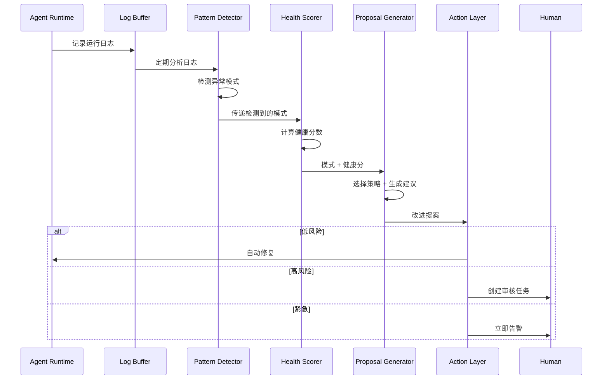
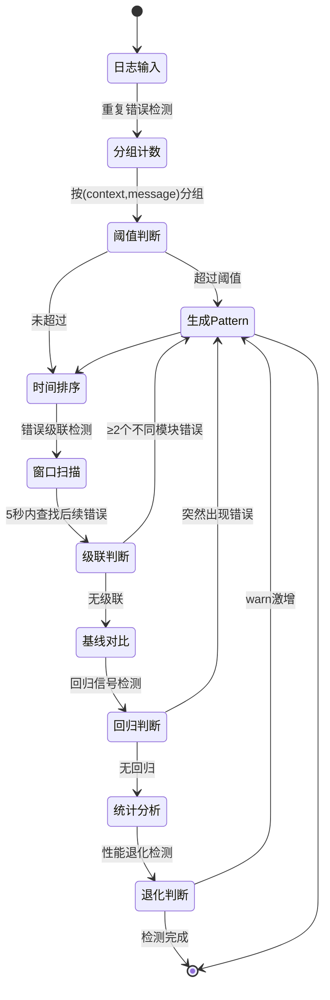
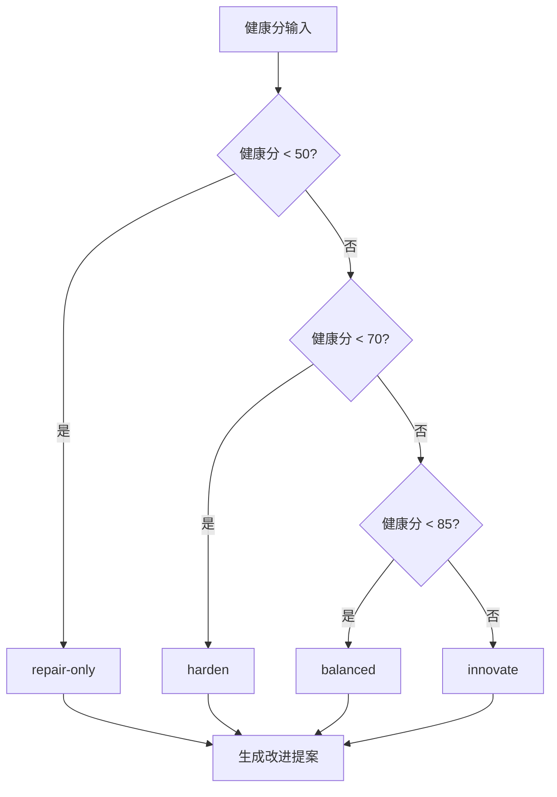

# Agent 自我进化：让 AI 学会修自己

> 从生产事故到持续改进：Agent 自我诊断与进化的工程实践

## 你遇到的场景

Agent 上线一周后开始出问题。

一开始只是偶尔超时，你没在意。后来某天凌晨，支付模块挂了。你爬起来看日志，发现同样的错误在三小时内出现了 47 次。

"为什么没有早点发现？"你一边修 bug 一边想，"要是 Agent 能自己发现问题就好了。"

这就是 Agent 自我进化的起点——让 Agent 从错误中学习，而不是等人工介入。

---

## 自我进化解决什么问题？

### 传统 vs 进化式流程对比

| 维度 | 传统流程 | 自我进化流程 |
|-----|---------|-------------|
| 问题发现 | ⚠️ 人工发现，滞后 | ✅ 自动监控，实时发现 |
| 排查速度 | ❌ 数小时到数天 | ✅ 分钟级定位 |
| 修复成本 | ⚠️ 高（人工介入） | ✅ 低（自动修复低风险问题） |
| 重复犯错 | ❌ 常见 | ✅ 系统学习避免 |
| 预警能力 | ❌ 无 | ✅ 趋势预测 |

### 痛点量化

```
┌─────────────────────────────────────────────────────────────┐
│              传统 Agent 运维成本分析                         │
├─────────────────────────────────────────────────────────────┤
│                                                              │
│  问题发现时间：平均 4-8 小时（用户投诉后才意识到）            │
│  排查时间：平均 2-6 小时（日志大海捞针）                      │
│  修复时间：平均 1-4 小时（开发→测试→部署）                   │
│  总停机时间：平均 7-18 小时                                  │
│                                                              │
│  月均事故次数：5-10 次                                       │
│  月均人力成本：35-180 人时                                   │
│  月均业务损失：难以估量                                      │
│                                                              │
└─────────────────────────────────────────────────────────────┘

┌─────────────────────────────────────────────────────────────┐
│              自我进化 Agent 运维成本分析                      │
├─────────────────────────────────────────────────────────────┤
│                                                              │
│  问题发现时间：分钟级（自动监控）                            │
│  排查时间：秒级（模式匹配）                                  │
│  修复时间：秒级（低风险自动修复）或 分钟级（人工审核）        │
│  总停机时间：分钟级                                          │
│                                                              │
│  月均事故次数：5-10 次（但大部分自动处理）                   │
│  月均人力成本：5-20 人时（仅处理高风险问题）                 │
│  月均业务损失：显著降低                                      │
│                                                              │
└─────────────────────────────────────────────────────────────┘
```

---

## 核心架构：三层自进化系统

### 整体架构图

```
┌─────────────────────────────────────────────────────────────────┐
│                        Agent Runtime                             │
│  ┌──────────┐  ┌──────────┐  ┌──────────┐  ┌──────────┐        │
│  │ Tool A   │  │ Tool B   │  │ Tool C   │  │ Tool D   │        │
│  │(文件操作)│  │(API调用) │  │(代码生成)│  │(数据库)  │        │
│  └────┬─────┘  └────┬─────┘  └────┬─────┘  └────┬─────┘        │
│       │             │             │             │               │
│       └─────────────┴──────┬──────┴─────────────┘               │
│                            ▼                                    │
│                  ┌──────────────────┐                          │
│                  │   Log Buffer     │  ← 收集所有运行日志       │
│                  │  (环形缓冲区)    │                          │
│                  └────────┬─────────┘                          │
└───────────────────────────┼────────────────────────────────────┘
                            │
                            ▼
┌─────────────────────────────────────────────────────────────────┐
│                    Evolution Engine                              │
│                                                                  │
│  ┌───────────────────────────────────────────────────────────┐  │
│  │              Layer 1: Pattern Detector                     │  │
│  │  ┌─────────────┐  ┌─────────────┐  ┌─────────────┐       │  │
│  │  │ 重复错误    │  │ 错误级联    │  │ 回归信号    │       │  │
│  │  │ 检测器      │  │ 分析器      │  │ 识别器      │       │  │
│  │  └─────────────┘  └─────────────┘  └─────────────┘       │  │
│  └───────────────────────────────────────────────────────────┘  │
│                            │                                     │
│                            ▼                                     │
│  ┌───────────────────────────────────────────────────────────┐  │
│  │              Layer 2: Health Scorer                        │  │
│  │  ┌─────────────┐  ┌─────────────┐  ┌─────────────┐       │  │
│  │  │ 错误率      │  │ 错误多样性  │  │ 时间分布    │       │  │
│  │  │ 计算(40%)   │  │ 分析(30%)   │  │ 加权(30%)   │       │  │
│  │  └─────────────┘  └─────────────┘  └─────────────┘       │  │
│  │                     ┌───────────┐                         │  │
│  │                     │ 健康分    │ 0-100                   │  │
│  │                     └───────────┘                         │  │
│  └───────────────────────────────────────────────────────────┘  │
│                            │                                     │
│                            ▼                                     │
│  ┌───────────────────────────────────────────────────────────┐  │
│  │              Layer 3: Proposal Generator                   │  │
│  │  ┌─────────────┐  ┌─────────────┐  ┌─────────────┐       │  │
│  │  │ 策略选择    │  │ 建议生成    │  │ 风险评估    │       │  │
│  │  └─────────────┘  └─────────────┘  └─────────────┘       │  │
│  └───────────────────────────────────────────────────────────┘  │
│                                                                  │
└─────────────────────────────────────────────────────────────────┘
                            │
                            ▼
┌─────────────────────────────────────────────────────────────────┐
│                       Action Layer                               │
│                                                                  │
│  ┌─────────────┐  ┌─────────────┐  ┌─────────────┐             │
│  │ 自动修复    │  │ 生成任务    │  │ 触发告警    │             │
│  │ (低风险)    │  │ (高风险)    │  │ (紧急)      │             │
│  └─────────────┘  └─────────────┘  └─────────────┘             │
│        │                │                │                      │
│        ▼                ▼                ▼                      │
│  ┌──────────┐     ┌──────────┐     ┌──────────┐               │
│  │ 直接执行 │     │ 人工审核 │     │ 立即通知 │               │
│  └──────────┘     └──────────┘     └──────────┘               │
│                                                                  │
└─────────────────────────────────────────────────────────────────┘
```

### 数据流转时序图



---

## 第一层：模式检测器

模式检测器负责从日志中发现"不正常"。不是单个错误，而是错误背后的规律。

### 四种检测模式

| 模式类型 | 检测逻辑 | 典型案例 | 严重程度判断 |
|---------|---------|---------|-------------|
| **重复错误** | 同一错误在同一 context 出现 N 次以上 | `ETIMEDOUT` 在 `payment-api.ts` 出现 47 次 | 次数 ≥10 → high, 否则 medium |
| **错误级联** | A 模块错误后，B 模块在 5s 内也出错 | auth-service 超时 → payment-api 超时 | 涉及 ≥3 个模块 → critical |
| **回归信号** | 历史上没问题的模块突然开始报错 | 稳定运行 30 天的模块，突然大量 500 错误 | 任何时候 → high |
| **性能退化** | warn 日志数量激增 | 重试次数从日均 50 次涨到 500 次 | 涨幅 ≥5x → high |

### 模式检测算法对比

| 算法 | 适用场景 | 精确度 | 延迟 | 实现复杂度 |
|-----|---------|-------|------|-----------|
| 计数法 | 重复错误 | 高 | 毫秒 | 低 |
| 时间窗口法 | 错误级联 | 中 | 秒 | 中 |
| 基线对比法 | 回归信号 | 高 | 分钟 | 中 |
| 统计分析 | 性能退化 | 中 | 分钟 | 高 |

### 核心代码实现

```python
from dataclasses import dataclass
from datetime import datetime
from collections import defaultdict
from typing import Optional

@dataclass
class LogEntry:
    timestamp: datetime
    level: str  # "error" | "warn" | "info" | "debug"
    message: str
    context: str  # 模块/文件名
    metadata: dict = None

@dataclass
class Pattern:
    type: str
    severity: str  # "low" | "medium" | "high" | "critical"
    description: str
    affected_contexts: list[str]
    first_seen: datetime
    last_seen: datetime
    root_cause: Optional[LogEntry] = None

class PatternDetector:
    """检测日志中的异常模式"""
    
    def __init__(self, config: dict = None):
        self.config = config or {
            "repeated_error_threshold": 3,
            "cascade_window_seconds": 5,
            "baseline_days": 7,
        }
    
    def detect_all(self, logs: list[LogEntry]) -> list[Pattern]:
        """运行所有检测器"""
        patterns = []
        patterns.extend(self.detect_repeated_errors(logs))
        patterns.extend(self.detect_error_cascades(logs))
        patterns.extend(self.detect_regressions(logs))
        patterns.extend(self.detect_performance_degradation(logs))
        return patterns
    
    def detect_repeated_errors(
        self, 
        logs: list[LogEntry],
    ) -> list[Pattern]:
        """检测重复错误"""
        threshold = self.config["repeated_error_threshold"]
        
        # 按 (context, message) 分组计数
        error_groups = defaultdict(list)
        for log in logs:
            if log.level == "error":
                key = (log.context, log.message)
                error_groups[key].append(log)
        
        # 筛选超过阈值的
        patterns = []
        for (context, message), group in error_groups.items():
            if len(group) >= threshold:
                patterns.append(Pattern(
                    type="repeated_error",
                    severity="high" if len(group) >= 10 else "medium",
                    description=f"{message} 在 {context} 出现 {len(group)} 次",
                    affected_contexts=[context],
                    first_seen=group[0].timestamp,
                    last_seen=group[-1].timestamp,
                ))
        
        return patterns
    
    def detect_error_cascades(
        self, 
        logs: list[LogEntry],
    ) -> list[Pattern]:
        """检测错误级联"""
        window = self.config["cascade_window_seconds"]
        
        # 按时间排序
        errors = sorted(
            [log for log in logs if log.level == "error"],
            key=lambda x: x.timestamp
        )
        
        cascades = []
        for i, error in enumerate(errors):
            # 查找时间窗口内的后续错误（不同模块）
            subsequent = [
                e for e in errors[i+1:]
                if (e.timestamp - error.timestamp).total_seconds() <= window
                and e.context != error.context
            ]
            
            if len(subsequent) >= 2:
                cascades.append(Pattern(
                    type="error_cascade",
                    severity="critical" if len(subsequent) >= 3 else "high",
                    description=f"{error.context} 错误级联到 {[e.context for e in subsequent]}",
                    affected_contexts=[error.context] + [e.context for e in subsequent],
                    first_seen=error.timestamp,
                    last_seen=subsequent[-1].timestamp,
                    root_cause=error,
                ))
        
        return cascades
```

### 检测流程状态图



### 为什么用规则而不是 LLM？

这是第一个关键架构决策。

| 维度 | LLM 方案 | 规则方案 | 决策 |
|-----|---------|---------|------|
| **可重现性** | ❌ 同样输入，输出可能不同 | ✅ 100% 确定 | ✅ 规则 |
| **处理速度** | ⚠️ 5-30 秒 | ✅ <100ms | ✅ 规则 |
| **运行成本** | ⚠️ $0.10-0.50/次 | ✅ 0 | ✅ 规则 |
| **幻觉风险** | ⚠️ 可能编造模式 | ✅ 只报告实际发现的 | ✅ 规则 |
| **语义理解** | ✅ 能理解错误含义 | ❌ 只看模式 | ⚠️ 后续用 LLM |
| **可审计性** | ⚠️ 难以解释原因 | ✅ 规则逻辑清晰 | ✅ 规则 |

**最终选择：规则优先，LLM 辅助**

```
┌─────────────────────────────────────────────────────────────┐
│                    混合架构决策                              │
├─────────────────────────────────────────────────────────────┤
│                                                              │
│  模式检测 → 规则方案（确定性、可审计、低延迟）              │
│                                                              │
│  改进建议生成 → LLM 方案（语义理解、创造性解决方案）        │
│                                                              │
│  为什么分开？                                                │
│  • 检测需要可重现（审计要求）                                │
│  • 建议可以创造性（人类最终审核）                            │
│                                                              │
└─────────────────────────────────────────────────────────────┘
```

---

## 第二层：健康评分器

模式检测告诉你"有什么问题"，健康评分告诉你"问题有多严重"。

### 评分公式详解

```
┌─────────────────────────────────────────────────────────────┐
│                    健康评分公式                              │
├─────────────────────────────────────────────────────────────┤
│                                                              │
│  Health Score = Error_Score × 0.4                           │
│               + Diversity_Score × 0.3                       │
│               + Ratio_Score × 0.2                           │
│               + Time_Score × 0.1                            │
│                                                              │
│  取值范围：0-100                                             │
│  • 90-100: 健康                                              │
│  • 70-89:  轻微问题                                          │
│  • 50-69:  中等问题                                          │
│  • 0-49:   严重问题                                          │
│                                                              │
└─────────────────────────────────────────────────────────────┘
```

### 四个评分维度

| 维度 | 权重 | 计算公式 | 含义 |
|-----|------|---------|------|
| **错误率** | 40% | `max(0, 100 - error_rate × 200)` | 错误越少，分数越高 |
| **错误多样性** | 30% | `unique_errors / total_errors × 100` | 多样性高=系统性问题，低=单点故障 |
| **警告/错误比** | 20% | `min(100, warn_error_ratio × 50)` | 警告多=提前预警好 |
| **时间分布** | 10% | `max(0, 100 - error_density × 10)` | 错误集中=突发事件更严重 |

### 为什么是多因素评分？

```
┌─────────────────────────────────────────────────────────────┐
│              单一指标的问题                                  │
├─────────────────────────────────────────────────────────────┤
│                                                              │
│  ❌ 只看错误率：                                             │
│     • 把 error 改成 warn → 错误率 0，但问题没解决           │
│     • 日志收集挂了 → 没有错误日志，错误率 0                 │
│                                                              │
│  ❌ 只看错误数量：                                           │
│     • 50 种不同错误，各出现 1 次 → 可能是新功能探索         │
│     • 1 种错误，出现 50 次 → 模块彻底坏了                   │
│     • 数量一样，严重程度完全不同                            │
│                                                              │
│  ✅ 多因素评分：                                             │
│     • 错误率 + 多样性 + 时间分布 = 更全面的健康画像         │
│     • 难以通过单一手段"刷分"                                │
│                                                              │
└─────────────────────────────────────────────────────────────┘
```

### 评分示例：支付模块超时事故

```
┌─────────────────────────────────────────────────────────────┐
│                  场景：支付模块超时                          │
├─────────────────────────────────────────────────────────────┤
│                                                              │
│  输入数据：                                                  │
│  • 日志总数：10,000                                          │
│  • 错误数：47（同一错误 `ETIMEDOUT`）                        │
│  • 警告数：156                                               │
│  • 错误时间跨度：3 小时                                      │
│                                                              │
│  计算过程：                                                  │
│  ┌─────────────────────────────────────────────────────┐   │
│  │ 1. 错误率：47/10000 = 0.47%                         │   │
│  │    Error_Score = 100 - 0.47 × 200 = 90.6           │   │
│  ├─────────────────────────────────────────────────────┤   │
│  │ 2. 错误多样性：1 种错误 / 47 次错误 = 0.02          │   │
│  │    Diversity_Score = 0.02 × 100 = 2                │   │
│  │    解读：极低，说明是单点问题，不是系统性缺陷       │   │
│  ├─────────────────────────────────────────────────────┤   │
│  │ 3. 警告/错误比：156/47 = 3.3                        │   │
│  │    Ratio_Score = min(100, 3.3 × 50) = 100          │   │
│  │    解读：警告多，提前预警做得好                     │   │
│  ├─────────────────────────────────────────────────────┤   │
│  │ 4. 时间分布：47 错误 / 10800 秒 = 0.004 错误/秒     │   │
│  │    Time_Score = 100 - 0.004 × 10 = 99.6            │   │
│  │    解读：错误分散，不是突发雪崩                     │   │
│  └─────────────────────────────────────────────────────┘   │
│                                                              │
│  最终健康分：                                                │
│  90.6 × 0.4 + 2 × 0.3 + 100 × 0.2 + 99.6 × 0.1 = 65.4     │
│                                                              │
│  解读：                                                      │
│  • 65 分 = 中等健康                                          │
│  • 问题在于错误多样性极低（单点故障）                        │
│  • 不是系统性的设计缺陷                                      │
│  • 建议：定位 payment-api.ts 的超时问题                      │
│                                                              │
└─────────────────────────────────────────────────────────────┘
```

### 健康分解读表

| 健康分 | 系统状态 | 典型特征 | 建议策略 |
|-------|---------|---------|---------|
| 90-100 | 健康 | 错误少、分布均匀 | `innovate` |
| 70-89 | 轻微问题 | 少量错误、有预警 | `balanced` |
| 50-69 | 中等问题 | 单点故障或性能退化 | `harden` |
| 0-49 | 严重问题 | 错误密集、级联失败 | `repair-only` |

---

## 第三层：提案生成器

知道了问题，下一步是"怎么改"。

### 四种进化策略

```
┌─────────────────────────────────────────────────────────────┐
│                    进化策略决策矩阵                          │
├─────────────────────────────────────────────────────────────┤
│                                                              │
│  健康分 ────────────────────────────────────────────────▶   │
│                                                              │
│  0 ────── 50 ────── 70 ────── 85 ────── 100                 │
│  │         │         │         │         │                  │
│  │ repair- │ harden  │balanced │innovate │                  │
│  │ only    │         │         │         │                  │
│  │         │         │         │         │                  │
│  │ 只修    │ 优先    │ 平衡    │ 优先    │                  │
│  │ 关键bug │ 降错    │ 可靠+   │ 新能力  │                  │
│  │         │         │ 功能    │         │                  │
│                                                              │
└─────────────────────────────────────────────────────────────┘
```

| 策略 | 触发条件 | 优先级排序 | 典型行为 |
|-----|---------|-----------|---------|
| `repair-only` | 健康分 < 50 | 只处理 `reliability` | 只修关键 bug，不优化 |
| `harden` | 健康分 50-69 | `reliability` > `performance` > `architecture` | 优先降低错误率 |
| `balanced` | 健康分 70-84 | 平衡所有类别 | 可靠性 + 新功能 |
| `innovate` | 健康分 ≥ 85 | `feature` > `performance` > `reliability` | 优先增加新能力 |

### 策略自动选择流程



### 改进建议分类

| 类别 | 说明 | 典型建议 | 风险等级 |
|-----|------|---------|---------|
| `reliability` | 可靠性改进 | 修复重复错误、添加重试、超时配置 | 低 |
| `performance` | 性能优化 | 缓存策略、并发优化、资源限制 | 中 |
| `architecture` | 架构改进 | 熔断器、服务降级、解耦依赖 | 中-高 |
| `feature` | 新功能 | 自动化增强、新工具集成 | 高 |

### 提案输出示例

```json
{
  "evolution_id": "evo-20260424-001",
  "strategy": "harden",
  "health_score": {
    "before": 65.4,
    "expected_after": 85.0,
    "improvement": "+19.6"
  },
  "recommendations": [
    {
      "id": "rec-001",
      "category": "reliability",
      "priority": "critical",
      "description": "修复 payment-api.ts 中的 ETIMEDOUT",
      "suggested_approach": [
        "检查 payment-api.ts 的超时配置",
        "添加重试逻辑（指数退避）",
        "监控支付 API 响应时间"
      ],
      "affected_files": ["payment-api.ts"],
      "estimated_effort": "低（<1小时）",
      "risk": "low",
      "auto_fixable": true
    },
    {
      "id": "rec-002",
      "category": "architecture",
      "priority": "high",
      "description": "添加 auth-service 熔断器防止级联失败",
      "suggested_approach": [
        "引入 opossum 或类似熔断器库",
        "配置失败阈值：5 次/分钟触发熔断",
        "实现降级逻辑"
      ],
      "affected_files": ["auth-service.ts", "payment-api.ts"],
      "estimated_effort": "中（2-4小时）",
      "risk": "medium",
      "auto_fixable": false
    }
  ],
  "risk_assessment": {
    "level": "low",
    "factors": [
      "改动范围小（2个文件）",
      "有明确的回滚路径",
      "不涉及数据迁移"
    ]
  },
  "estimated_improvement": {
    "health_score_after": 85.0,
    "error_reduction": "80%",
    "confidence": "high"
  }
}
```

---

## 部署实践：集成到 Agent 生命周期

### 三个集成点

```
┌─────────────────────────────────────────────────────────────────┐
│                  Agent 生命周期集成点                           │
├─────────────────────────────────────────────────────────────────┤
│                                                                  │
│  部署前                    运行时                    定期检查    │
│  ┌──────────┐            ┌──────────┐            ┌──────────┐  │
│  │ Pre-     │            │ Runtime  │            │ Daily    │  │
│  │ Deploy   │            │ Monitor  │            │ Review   │  │
│  │ Check    │            │          │            │          │  │
│  └────┬─────┘            └────┬─────┘            └────┬─────┘  │
│       │                       │                       │         │
│       ▼                       ▼                       ▼         │
│  健康分检查              实时健康分              生成进化报告   │
│  < 75 阻止部署            < 70 触发告警            人工审核建议 │
│                                                                  │
│  频率：每次部署           频率：每小时             频率：每天    │
│                                                                  │
└─────────────────────────────────────────────────────────────────┘
```

### 集成点对比

| 集成点 | 触发频率 | 检查范围 | 阈值 | 动作 |
|-------|---------|---------|------|------|
| **部署前检查** | 每次部署 | staging 环境 24h 日志 | 健康分 < 75 阻止部署 | CI/CD 门禁 |
| **实时监控** | 每小时 | 生产环境 1h 日志 | 健康分 < 70 触发告警 | 告警 + 自动生成任务 |
| **每日报告** | 每天 | 生产环境 24h 日志 | 无阈值 | 生成改进建议 |

### 部署前检查流程

```python
async def pre_deployment_check():
    """部署前健康检查 - CI/CD 门禁"""
    
    # 获取 staging 环境最近 24 小时日志
    staging_logs = await fetch_logs(environment="staging", hours=24)
    
    # 数据完整性检查
    if len(staging_logs) < EXPECTED_MIN_LOGS:
        print(f"⚠️ 日志数量不足：{len(staging_logs)} < {EXPECTED_MIN_LOGS}")
        print("可能是日志收集模块故障，跳过健康检查")
        return  # 或 sys.exit(1) 根据策略
    
    # 分析健康分
    analysis = await evolution_engine.analyze(staging_logs)
    
    baseline = 75  # 最低健康分
    
    if analysis.health_score < baseline:
        print(f"❌ 健康分 {analysis.health_score} < {baseline}，阻止部署")
        print("\n关键问题：")
        for pattern in analysis.patterns:
            if pattern.severity in ["high", "critical"]:
                print(f"  • [{pattern.severity}] {pattern.description}")
        sys.exit(1)
    
    print(f"✅ 健康分 {analysis.health_score}，允许部署")
```

### 实时监控流程

```python
async def runtime_monitor():
    """实时监控 - 每小时检查"""
    
    while True:
        # 获取最近 1 小时日志
        logs = await fetch_logs(hours=1)
        
        # 健康分析
        analysis = await evolution_engine.analyze(logs)
        
        if analysis.health_score < 70:
            # 触发告警
            await alert_team(
                f"🚨 健康分 {analysis.health_score}，请检查\n"
                f"关键问题：{len([p for p in analysis.patterns if p.severity == 'critical'])} 个"
            )
            
            # 自动生成改进任务
            proposal = await evolution_engine.evolve(logs, strategy="harden")
            
            # 低风险自动修复
            for rec in proposal.recommendations:
                if rec.risk == "low" and rec.auto_fixable:
                    await auto_fix(rec)
                else:
                    await create_task(rec, requires_review=True)
        
        # 等待下次检查
        await asyncio.sleep(3600)  # 1 小时
```

### 每日进化报告

```python
async def daily_evolution_report():
    """每日进化报告"""
    
    logs = await fetch_logs(hours=24)
    
    proposal = await evolution_engine.evolve(logs, strategy="balanced")
    
    # 生成报告
    report = f"""
# 每日进化报告 - {datetime.now().strftime('%Y-%m-%d')}

## 健康状态
- 当前健康分：{proposal.health_score_before}
- 预期改进后：{proposal.health_score_after}

## 改进建议
| 优先级 | 类别 | 描述 | 风险 |
|--------|------|------|------|
"""
    
    for rec in proposal.recommendations:
        report += f"| {rec.priority} | {rec.category} | {rec.description} | {rec.risk} |\n"
    
    # 保存报告
    await save_report(report)
    
    # 只通知关键改进
    critical = [r for r in proposal.recommendations if r.priority == "critical"]
    if critical:
        await notify_team(f"今日 {len(critical)} 个关键改进建议")
```

---

## 踩坑经验

### 坑 1：过度自动化

```
┌─────────────────────────────────────────────────────────────┐
│                    过度自动化事故                            │
├─────────────────────────────────────────────────────────────┤
│                                                              │
│  事件：Agent 自动修改了生产环境配置                          │
│  原因：误判"配置不一致"为错误                               │
│  影响：服务中断 15 分钟                                      │
│                                                              │
│  根本原因：                                                  │
│  • 没有区分"错误"和"配置差异"                               │
│  • 自动修复没有风险评估                                      │
│  • 缺少人工审核环节                                          │
│                                                              │
│  解决方案：                                                  │
│  ┌───────────────────────────────────────────────────────┐  │
│  │ 风险分级处理                                           │  │
│  │                                                       │  │
│  │ 低风险（自动修复）：                                   │  │
│  │  • 重试逻辑调整                                        │  │
│  │  • 超时参数微调                                        │  │
│  │  • 日志级别调整                                        │  │
│  │                                                       │  │
│  │ 中风险（人工审核）：                                   │  │
│  │  • 熔断器配置                                          │  │
│  │  • 服务降级策略                                        │  │
│  │                                                       │  │
│  │ 高风险（必须审批）：                                   │  │
│  │  • 修改生产配置                                        │  │
│  │  • 数据迁移                                            │  │
│  │  • 架构变更                                            │  │
│  └───────────────────────────────────────────────────────┘  │
│                                                              │
└─────────────────────────────────────────────────────────────┘
```

### 坑 2：健康分被"刷"

```
┌─────────────────────────────────────────────────────────────┐
│                    健康分"刷分"事故                          │
├─────────────────────────────────────────────────────────────┤
│                                                              │
│  现象：健康分突然涨到 98                                     │
│  以为是改进有效，实际是日志收集模块挂了                      │
│                                                              │
│  问题：                                                      │
│  • 没有错误日志 → 错误率 0 → 健康分高                       │
│  • 但系统实际上在崩溃                                        │
│                                                              │
│  解决方案：数据完整性检查                                    │
                                                              │
│  ┌───────────────────────────────────────────────────────┐  │
│  │ def compute_health_score(logs):                        │  │
│  │     # 检查数据完整性                                   │  │
│  │     if len(logs) < EXPECTED_MIN_LOGS:                  │  │
│  │         # 日志太少，可能是收集模块出问题               │  │
│  │         return None  # 无法计算，触发告警              │  │
│  │                                                        │  │
│  │     # 检查日志时间分布                                 │  │
│  │     if logs[-1].timestamp - logs[0].timestamp < 300:   │  │
│  │         # 日志集中在 5 分钟内，可能是延迟上报           │  │
│  │         return None                                    │  │
│  │                                                        │  │
│  │     # 正常计算...                                      │  │
│  └───────────────────────────────────────────────────────┘  │
│                                                              │
└─────────────────────────────────────────────────────────────┘
```

### 坑 3：策略选择错误

```
┌─────────────────────────────────────────────────────────────┐
│                    策略固化问题                              │
├─────────────────────────────────────────────────────────────┤
│                                                              │
│  场景：系统已经很稳定（健康分 90）                           │
│  但策略固定为 `harden`                                       │
│                                                              │
│  后果：                                                      │
│  • 一直在优化已解决的问题                                    │
│  • 忽略了新功能需求                                          │
│  • 浪费开发资源                                              │
│                                                              │
│  解决：策略必须动态调整                                      │
│                                                              │
│  ┌───────────────────────────────────────────────────────┐  │
│  │ # ❌ 错误：固定策略                                    │  │
│  │ proposal = evolution_engine.evolve(logs,               │  │
│  │     strategy="harden")  # 固定写死                     │  │
│  │                                                        │  │
│  │ # ✅ 正确：动态策略                                    │  │
│  │ proposal = evolution_engine.evolve(logs,               │  │
│  │     strategy="auto")  # 根据健康分自动选择             │  │
│  └───────────────────────────────────────────────────────┘  │
│                                                              │
└─────────────────────────────────────────────────────────────┘
```

### 踩坑总结表

| 坑 | 现象 | 根本原因 | 解决方案 |
|----|------|---------|---------|
| 过度自动化 | 自动修复导致生产事故 | 缺少风险评估 | 按风险分级处理 |
| 健康分被刷 | 健康分虚高但系统崩溃 | 数据完整性未检查 | 添加数据完整性检查 |
| 策略固化 | 优化已解决问题 | 策略写死 | 使用 `auto` 动态选择 |

---

## 关键决策回顾

### 决策 1：为什么不用 LLM 做模式检测？

| 考量因素 | LLM 方案 | 规则方案 | 最终选择 |
|---------|---------|---------|---------|
| 可审计性 | ❌ 难以解释 | ✅ 规则逻辑清晰 | ✅ 规则 |
| 可重现性 | ❌ 输出不确定 | ✅ 100% 确定 | ✅ 规则 |
| 处理延迟 | ⚠️ 5-30 秒 | ✅ <100ms | ✅ 规则 |
| 幻觉风险 | ⚠️ 存在 | ✅ 无 | ✅ 规则 |

### 决策 2：为什么健康分是多因素？

| 方案 | 问题 |
|-----|------|
| 只看错误率 | 可以把 error 改成 warn 来"刷分" |
| 只看错误数量 | 50 种错误 vs 1 种错误 50 次，严重程度不同 |
| 多因素评分 | 难以作弊，更接近真实系统状态 |

### 决策 3：为什么需要策略？

| 场景 | 正确策略 | 错误策略后果 |
|-----|---------|-------------|
| 系统在崩溃 | `repair-only` | 继续加功能会让问题更严重 |
| 系统稳定 | `innovate` | 只修 bug 会错失发展机会 |

---

## 下一步

自我进化不是终点。进化的尽头是：

```
┌─────────────────────────────────────────────────────────────┐
│                  Agent 进化路线图                            │
├─────────────────────────────────────────────────────────────┤
│                                                              │
│  Level 1: 自我诊断（本文）                                   │
│  ├─ 模式检测                                                │
│  ├─ 健康评分                                                │
│  └─ 改进提案                                                │
│                                                              │
│  Level 2: 自我修复                                          │
│  ├─ 自动修复低风险问题                                      │
│  ├─ 人工审核高风险问题                                      │
│  └─ 回滚机制                                                │
│                                                              │
│  Level 3: 自我测试                                          │
│  ├─ 改进后自动验证效果                                      │
│  ├─ 回归测试                                                │
│  └─ 性能基准                                                │
│                                                              │
│  Level 4: 自我规划                                          │
│  ├─ 从"修 bug"进化到"优化架构"                              │
│  ├─ 预测潜在问题                                            │
│  └─ 主动改进                                                │
│                                                              │
└─────────────────────────────────────────────────────────────┘
```

---

## 检查清单

实现 Agent 自我进化前，确认：

| 检查项 | 必须 | 原因 |
|-------|------|------|
| 日志收集覆盖所有关键模块 | ✅ | 没有日志就没有分析依据 |
| 模式检测逻辑可重现 | ✅ | 审计要求 |
| 健康分计算考虑数据完整性 | ✅ | 防止"刷分" |
| 策略选择自动化 | ✅ | 适应系统状态变化 |
| 自动修复只用于低风险操作 | ✅ | 防止过度自动化 |
| 部署前有健康检查门禁 | ✅ | 阻止问题上线 |
| 每日有进化报告 | ⚠️ 推荐 | 持续改进 |

---

**相关文章**：
- Agent 崩了怎么办？错误处理与重试
- 如何知道你的 Agent 跑得好不好？
- Agent 流式输出，用户体验翻倍
