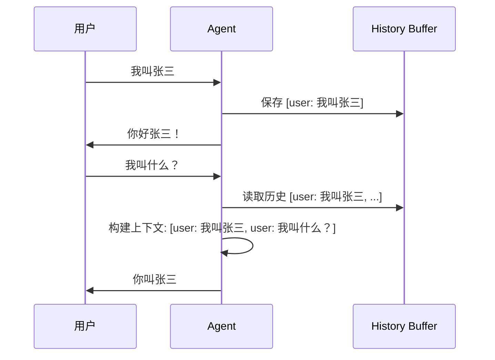
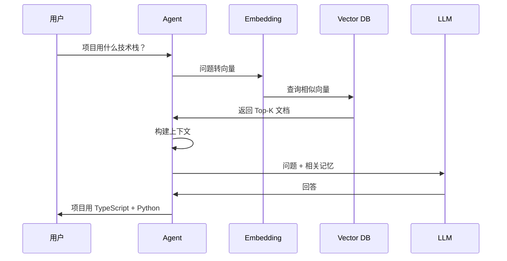

# Agent 记忆演进：从金鱼到图书馆

> 让 Agent 记住关键信息，而不是每次都从零开始

## 你遇到的场景

你花了 20 分钟跟 Agent 解释项目背景、技术栈、团队规范。

5 轮对话后，你问："刚才说的数据库用什么来着？"

Agent 回答："我没有看到之前的对话记录。"

这一刻，你想砸键盘。

这就是 Agent 的记忆问题——**每次对话都是失忆症患者**。

---

## 记忆演进路线图

```
┌─────────────────────────────────────────────────────────────────┐
│                    Agent 记忆演进路线                            │
├─────────────────────────────────────────────────────────────────┤
│                                                                  │
│  Level 0        Level 1        Level 2        Level 3          │
│  无记忆         会话记忆       长期记忆       向量检索          │
│  ┌────────┐    ┌────────┐    ┌────────┐    ┌────────┐         │
│  │ 每次都 │ → │ 会话内 │ → │ 跨会话 │ → │ 智能   │         │
│  │ 从零   │    │ 记住   │    │ 记住   │    │ 检索   │         │
│  │ 开始   │    │        │    │        │    │        │         │
│  └────────┘    └────────┘    └────────┘    └────────┘         │
│                                                                  │
│  特性：         特性：          特性：          特性：           │
│  • 无状态      • 会话内保持    • 持久化存储    • 语义检索       │
│  • 无上下文    • 对话历史      • 关键信息      • 相关性排序     │
│  • 每次重问    • 自动管理      • 需要显式保存  • 自动压缩       │
│                                                                  │
│  适用：         适用：          适用：          适用：           │
│  一次性任务    单次对话        多次交互        长期知识库       │
│                                                                  │
│  成本：低       成本：中        成本：中高      成本：高         │
│  复杂度：低     复杂度：中      复杂度：中      复杂度：高       │
│                                                                  │
└─────────────────────────────────────────────────────────────────┘
```

### 四级记忆对比

| 维度 | Level 0 无记忆 | Level 1 会话记忆 | Level 2 长期记忆 | Level 3 向量检索 |
|-----|---------------|-----------------|-----------------|-----------------|
| **记忆范围** | 无 | 当前会话 | 跨会话 | 跨会话 + 语义检索 |
| **存储方式** | 无 | 内存 | 文件/数据库 | 向量数据库 |
| **Token 消耗** | 最低 | 高（全量历史） | 中（压缩后） | 低（只检索相关） |
| **检索速度** | N/A | 快 | 中 | 快 |
| **实现复杂度** | 低 | 低 | 中 | 高 |
| **适用场景** | 一次性任务 | 单次对话 | 多次交互 | 长期知识库 |

---

## Level 0：无记忆

### 架构图

```
┌─────────────────────────────────────────────────────────────┐
│                    无记忆架构                                │
├─────────────────────────────────────────────────────────────┤
│                                                              │
│  ┌──────────┐     ┌──────────┐     ┌──────────┐            │
│  │  用户    │────▶│   LLM    │────▶│   响应   │            │
│  └──────────┘     └──────────┘     └──────────┘            │
│                         │                                    │
│                         ▼                                    │
│                    无状态请求                                │
│                    每次都是新对话                            │
│                                                              │
└─────────────────────────────────────────────────────────────┘
```

### 代码示例

```python
# 最简单的 Agent：无记忆
from openai import OpenAI

client = OpenAI()

def chat(user_input: str) -> str:
    """每次都是新对话"""
    response = client.chat.completions.create(
        model="gpt-4",
        messages=[
            {"role": "user", "content": user_input}
        ]
    )
    return response.choices[0].message.content

# 问题：每次调用都没有上下文
print(chat("我叫张三"))          # 你好张三！
print(chat("我叫什么？"))        # 抱歉，我不知道你的名字
```

### 优缺点分析

| 优点 | 缺点 |
|-----|------|
| ✅ 实现简单 | ❌ 每次都要重新解释背景 |
| ✅ 无状态，易扩展 | ❌ 用户体验差 |
| ✅ Token 消耗最低 | ❌ 无法处理连续任务 |
| ✅ 无隐私问题 | ❌ 无法记住用户偏好 |

### 适用场景

- ✅ 一次性问答
- ✅ 文本翻译
- ✅ 代码格式化
- ❌ 多轮对话
- ❌ 项目协作
- ❌ 个人助理

---

## Level 1：会话记忆

### 架构图

```
┌─────────────────────────────────────────────────────────────┐
│                    会话记忆架构                              │
├─────────────────────────────────────────────────────────────┤
│                                                              │
│  ┌──────────┐     ┌──────────┐     ┌──────────┐            │
│  │  用户    │────▶│   LLM    │────▶│   响应   │            │
│  └──────────┘     └────┬─────┘     └──────────┘            │
│                        │                                    │
│                        ▼                                    │
│               ┌──────────────────┐                          │
│               │  Message History │  ← 内存中保存            │
│               │  [msg1, msg2...] │                          │
│               └──────────────────┘                          │
│                        │                                    │
│                        ▼                                    │
│               下次请求带上历史                               │
│                                                              │
└─────────────────────────────────────────────────────────────┘
```

### 对话流程时序图



### 代码实现

```python
from openai import OpenAI
from typing import List, Dict

client = OpenAI()

class SessionMemory:
    """会话记忆：内存中保存对话历史"""
    
    def __init__(self, max_messages: int = 50):
        self.messages: List[Dict] = []
        self.max_messages = max_messages
    
    def add(self, role: str, content: str):
        """添加消息"""
        self.messages.append({"role": role, "content": content})
        
        # 超过限制，删除最早的
        if len(self.messages) > self.max_messages:
            self.messages = self.messages[-self.max_messages:]
    
    def get_context(self) -> List[Dict]:
        """获取上下文"""
        return self.messages.copy()
    
    def clear(self):
        """清空记忆"""
        self.messages = []

# 使用会话记忆的 Agent
class Agent:
    def __init__(self):
        self.memory = SessionMemory(max_messages=20)
    
    def chat(self, user_input: str) -> str:
        # 添加用户消息
        self.memory.add("user", user_input)
        
        # 发送请求（带上历史）
        response = client.chat.completions.create(
            model="gpt-4",
            messages=self.memory.get_context()
        )
        
        # 保存响应
        assistant_message = response.choices[0].message.content
        self.memory.add("assistant", assistant_message)
        
        return assistant_message

# 使用
agent = Agent()
print(agent.chat("我叫张三"))        # 你好张三！
print(agent.chat("我叫什么？"))      # 你叫张三
print(agent.chat("我们聊了什么？"))  # 你告诉我你叫张三
```

### Token 消耗分析

```
┌─────────────────────────────────────────────────────────────┐
│                    Token 消耗计算                            │
├─────────────────────────────────────────────────────────────┤
│                                                              │
│  假设：                                                      │
│  • 每条消息平均 100 tokens                                   │
│  • 保留最近 20 条消息                                        │
│  • 用户输入 50 tokens                                        │
│  • 响应 100 tokens                                           │
│                                                              │
│  每次请求消耗：                                              │
│  = 历史消息 + 用户输入 + 响应                                │
│  = 20 × 100 + 50 + 100                                       │
│  = 2150 tokens                                               │
│                                                              │
│  10 轮对话后：                                               │
│  = 20 × 100 + 20 × 100 + 50 + 100                           │
│  = 4150 tokens（几乎翻倍）                                   │
│                                                              │
│  问题：                                                      │
│  • Token 消耗线性增长                                        │
│  • 超过上下文窗口限制怎么办？                                │
│                                                              │
└─────────────────────────────────────────────────────────────┘
```

### 三种 Token 限制处理策略

| 策略 | 实现方式 | 优点 | 缺点 |
|-----|---------|------|------|
| **截断** | 只保留最近 N 条 | 简单 | 丢失早期信息 |
| **压缩** | LLM 生成摘要 | 保留关键信息 | 额外 API 调用 |
| **滑动窗口** | 固定窗口大小 | 可控 | 可能丢失重要信息 |

### 压缩策略实现

```python
class CompressingMemory(SessionMemory):
    """带压缩的会话记忆"""
    
    def __init__(self, max_tokens: int = 4000, compress_threshold: int = 3000):
        super().__init__()
        self.max_tokens = max_tokens
        self.compress_threshold = compress_threshold
        self.encoding = tiktoken.encoding_for_model("gpt-4")
    
    def count_tokens(self) -> int:
        """计算当前 token 数"""
        total = 0
        for msg in self.messages:
            total += len(self.encoding.encode(msg["content"]))
        return total
    
    def compress(self):
        """压缩历史消息"""
        if self.count_tokens() < self.compress_threshold:
            return
        
        # 保留系统消息和最近 5 条
        system_messages = [m for m in self.messages if m["role"] == "system"]
        recent_messages = self.messages[-5:]
        
        # 中间消息生成摘要
        to_compress = self.messages[len(system_messages):-5]
        if to_compress:
            summary = self._generate_summary(to_compress)
            self.messages = system_messages + [
                {"role": "system", "content": f"[历史摘要] {summary}"}
            ] + recent_messages
    
    def _generate_summary(self, messages: List[Dict]) -> str:
        """用 LLM 生成摘要"""
        prompt = "请用一段话总结以下对话的关键信息：\n\n"
        for msg in messages:
            prompt += f"{msg['role']}: {msg['content']}\n"
        
        response = client.chat.completions.create(
            model="gpt-4",
            messages=[{"role": "user", "content": prompt}]
        )
        return response.choices[0].message.content
```

### 踩坑：Token 超限

```
┌─────────────────────────────────────────────────────────────┐
│                    Token 超限事故                            │
├─────────────────────────────────────────────────────────────┤
│                                                              │
│  现象：API 报错 "context_length_exceeded"                   │
│                                                              │
│  原因：                                                      │
│  • 历史消息积累超过模型限制（GPT-4: 8K tokens）             │
│  • 没有做 Token 计数和限制                                   │
│                                                              │
│  解决：                                                      │
│  1. 实时计数                                                 │
│  2. 触发阈值时压缩                                           │
│  3. 滑动窗口                                                 │
│                                                              │
│  ┌───────────────────────────────────────────────────────┐  │
│  │ def chat(self, user_input):                           │  │
│  │     self.memory.add("user", user_input)               │  │
│  │                                                       │  │
│  │     # 检查 token 数                                   │  │
│  │     if self.memory.count_tokens() > MAX_TOKENS:       │  │
│  │         self.memory.compress()  # 压缩                │  │
│  │                                                       │  │
│  │     # 发送请求...                                     │  │
│  └───────────────────────────────────────────────────────┘  │
│                                                              │
└─────────────────────────────────────────────────────────────┘
```

---

## Level 2：长期记忆

### 架构图

```
┌─────────────────────────────────────────────────────────────┐
│                    长期记忆架构                              │
├─────────────────────────────────────────────────────────────┤
│                                                              │
│  ┌──────────┐                                               │
│  │  用户    │                                               │
│  └────┬─────┘                                               │
│       │                                                      │
│       ▼                                                      │
│  ┌──────────────────────────────────────────────────────┐   │
│  │                  Memory Manager                       │   │
│  │  ┌─────────────┐  ┌─────────────┐  ┌─────────────┐  │   │
│  │  │ 会话记忆    │  │ 长期记忆    │  │ 工作记忆    │  │   │
│  │  │ (内存)      │  │ (文件/DB)   │  │ (当前任务)  │  │   │
│  │  └─────────────┘  └─────────────┘  └─────────────┘  │   │
│  └──────────────────────────────────────────────────────┘   │
│       │                                                      │
│       ▼                                                      │
│  ┌──────────┐     ┌──────────┐                             │
│  │   LLM    │────▶│   响应   │                             │
│  └──────────┘     └──────────┘                             │
│                                                              │
│  关键：跨会话保留重要信息                                    │
│                                                              │
└─────────────────────────────────────────────────────────────┘
```

### 记忆分层模型

```
┌─────────────────────────────────────────────────────────────┐
│                    记忆分层模型                              │
├─────────────────────────────────────────────────────────────┤
│                                                              │
│  ┌─────────────────────────────────────────────────────┐   │
│  │ Level 3: 工作记忆（Working Memory）                  │   │
│  │ • 当前任务相关                                       │   │
│  │ • 生命周期：任务结束                                 │   │
│  │ • 示例：当前对话目标、临时变量                       │   │
│  └─────────────────────────────────────────────────────┘   │
│                           │                                  │
│                           ▼                                  │
│  ┌─────────────────────────────────────────────────────┐   │
│  │ Level 2: 会话记忆（Session Memory）                  │   │
│  │ • 当前会话对话历史                                   │   │
│  │ • 生命周期：会话结束                                 │   │
│  │ • 示例：对话消息列表                                 │   │
│  └─────────────────────────────────────────────────────┘   │
│                           │                                  │
│                           ▼                                  │
│  ┌─────────────────────────────────────────────────────┐   │
│  │ Level 1: 长期记忆（Long-term Memory）                │   │
│  │ • 用户偏好、重要事实                                 │   │
│  │ • 生命周期：永久                                     │   │
│  │ • 示例：用户姓名、项目背景、技术栈                   │   │
│  └─────────────────────────────────────────────────────┘   │
│                           │                                  │
│                           ▼                                  │
│  ┌─────────────────────────────────────────────────────┐   │
│  │ Level 0: 系统提示（System Prompt）                   │   │
│  │ • Agent 角色定义、行为规范                           │   │
│  │ • 生命周期：永久                                     │   │
│  │ • 示例：你是代码助手，遵循以下规范...                │   │
│  └─────────────────────────────────────────────────────┘   │
│                                                              │
└─────────────────────────────────────────────────────────────┘
```

### 代码实现

```python
import json
from pathlib import Path
from datetime import datetime
from typing import Optional
from dataclasses import dataclass, field, asdict

@dataclass
class Memory:
    """长期记忆项"""
    key: str                    # 记忆键
    value: str                  # 记忆值
    category: str               # 分类：user_info, project, preference
    importance: int = 1         # 重要性 1-5
    created_at: str = field(default_factory=lambda: datetime.now().isoformat())
    last_accessed: str = field(default_factory=lambda: datetime.now().isoformat())
    access_count: int = 0

class LongTermMemory:
    """长期记忆管理"""
    
    def __init__(self, storage_path: str = "memory.json"):
        self.storage_path = Path(storage_path)
        self.memories: dict[str, Memory] = {}
        self._load()
    
    def _load(self):
        """从文件加载"""
        if self.storage_path.exists():
            data = json.loads(self.storage_path.read_text())
            for key, value in data.items():
                self.memories[key] = Memory(**value)
    
    def _save(self):
        """保存到文件"""
        data = {k: asdict(v) for k, v in self.memories.items()}
        self.storage_path.write_text(json.dumps(data, ensure_ascii=False, indent=2))
    
    def remember(self, key: str, value: str, category: str = "general", importance: int = 1):
        """记住信息"""
        self.memories[key] = Memory(
            key=key,
            value=value,
            category=category,
            importance=importance
        )
        self._save()
    
    def recall(self, key: str) -> Optional[str]:
        """回忆信息"""
        if key in self.memories:
            memory = self.memories[key]
            memory.last_accessed = datetime.now().isoformat()
            memory.access_count += 1
            self._save()
            return memory.value
        return None
    
    def recall_by_category(self, category: str) -> list[Memory]:
        """按类别回忆"""
        return [m for m in self.memories.values() if m.category == category]
    
    def forget(self, key: str):
        """遗忘信息"""
        if key in self.memories:
            del self.memories[key]
            self._save()
    
    def get_context_for_llm(self, max_items: int = 10) -> str:
        """生成 LLM 上下文"""
        # 按重要性和访问次数排序
        sorted_memories = sorted(
            self.memories.values(),
            key=lambda m: (m.importance, m.access_count),
            reverse=True
        )[:max_items]
        
        context = "【长期记忆】\n"
        for m in sorted_memories:
            context += f"- {m.key}: {m.value}\n"
        
        return context

# 使用
ltm = LongTermMemory()
ltm.remember("user_name", "张三", "user_info", importance=5)
ltm.remember("project", "jojo-code", "project", importance=4)
ltm.remember("tech_stack", "TypeScript + Python", "project", importance=3)

# 构建上下文
context = ltm.get_context_for_llm()
print(context)
# 【长期记忆】
# - user_name: 张三
# - project: jojo-code
# - tech_stack: TypeScript + Python
```

### 记忆分类表

| 类别 | 说明 | 示例 | 重要性 |
|-----|------|------|-------|
| `user_info` | 用户个人信息 | 姓名、职位、联系方式 | 高 |
| `project` | 项目信息 | 项目名、技术栈、架构 | 高 |
| `preference` | 用户偏好 | 代码风格、工具选择 | 中 |
| `knowledge` | 领域知识 | 最佳实践、常见问题 | 中 |
| `temp` | 临时信息 | 当前任务、临时变量 | 低 |

### 踩坑：记忆污染

```
┌─────────────────────────────────────────────────────────────┐
│                    记忆污染问题                              │
├─────────────────────────────────────────────────────────────┤
│                                                              │
│  场景：                                                      │
│  用户：我的项目叫 nano-code                                  │
│  （后来改名了）                                              │
│  用户：我的项目叫 jojo-code                                  │
│                                                              │
│  问题：                                                      │
│  • 长期记忆里有两个项目名                                    │
│  • Agent 不知道用哪个                                        │
│                                                              │
│  解决：                                                      │
│  ┌───────────────────────────────────────────────────────┐  │
│  │ 1. 更新而非追加                                        │  │
│  │    if key exists: update else: insert                 │  │
│  │                                                       │  │
│  │ 2. 版本控制                                            │  │
│  │    记录变更历史，支持回滚                              │  │
│  │                                                       │  │
│  │ 3. 时效性                                              │  │
│  │    过期信息自动标记为"已过时"                          │  │
│  └───────────────────────────────────────────────────────┘  │
│                                                              │
│  代码：                                                      │
│  def remember(self, key, value, ...):                       │
│      if key in self.memories:                               │
│          # 保留历史版本                                      │
│          old = self.memories[key]                           │
│          old.status = "superseded"                          │
│          self.memories[f"{key}_history"].append(old)        │
│      # 插入新版本                                            │
│      self.memories[key] = Memory(...)                       │
│                                                              │
└─────────────────────────────────────────────────────────────┘
```

---

## Level 3：向量检索

### 架构图

```
┌─────────────────────────────────────────────────────────────┐
│                    向量检索架构                              │
├─────────────────────────────────────────────────────────────┤
│                                                              │
│  ┌──────────┐                                               │
│  │  用户    │                                               │
│  └────┬─────┘                                               │
│       │                                                      │
│       ▼                                                      │
│  ┌──────────────────────────────────────────────────────┐   │
│  │              Query Processing                         │   │
│  │  ┌─────────────┐                                      │   │
│  │  │ Embedding   │  用户问题 → 向量                     │   │
│  │  └─────────────┘                                      │   │
│  └──────────────────────────────────────────────────────┘   │
│       │                                                      │
│       ▼                                                      │
│  ┌──────────────────────────────────────────────────────┐   │
│  │              Vector Database                          │   │
│  │  ┌─────────────────────────────────────────────────┐ │   │
│  │  │  ┌─────┐  ┌─────┐  ┌─────┐  ┌─────┐            │ │   │
│  │  │  │Doc1 │  │Doc2 │  │Doc3 │  │Doc4 │            │ │   │
│  │  │  │向量 │  │向量 │  │向量 │  │向量 │            │ │   │
│  │  │  └─────┘  └─────┘  └─────┘  └─────┘            │ │   │
│  │  │                                                 │ │   │
│  │  │  相似度检索 → Top-K 最相关文档                   │ │   │
│  │  └─────────────────────────────────────────────────┘ │   │
│  └──────────────────────────────────────────────────────┘   │
│       │                                                      │
│       ▼                                                      │
│  ┌──────────┐     ┌──────────┐                             │
│  │   LLM    │────▶│   响应   │                             │
│  │ + 上下文 │     │          │                             │
│  └──────────┘     └──────────┘                             │
│                                                              │
└─────────────────────────────────────────────────────────────┘
```

### 向量数据库对比

| 数据库 | 部署方式 | 性能 | 特点 | 适用场景 |
|-------|---------|------|------|---------|
| **Chroma** | 嵌入式 | 中 | 轻量、易用、开源 | 小型项目、原型 |
| **Pinecone** | 云服务 | 高 | 托管、弹性扩展 | 生产环境 |
| **Milvus** | 自托管 | 高 | 分布式、高性能 | 大规模数据 |
| **Weaviate** | 自托管/云 | 高 | GraphQL、混合检索 | 企业级 |
| **Qdrant** | 自托管/云 | 高 | Rust 实现、高性能 | 高性能场景 |

### 代码实现（Chroma）

```python
import chromadb
from chromadb.utils import embedding_functions
from openai import OpenAI

client = OpenAI()

class VectorMemory:
    """向量检索记忆"""
    
    def __init__(self, persist_dir: str = "./chroma_db"):
        # 初始化 Chroma
        self.chroma = chromadb.PersistentClient(path=persist_dir)
        
        # 使用 OpenAI embeddings
        self.embedding_fn = embedding_functions.OpenAIEmbeddingFunction(
            api_key=os.getenv("OPENAI_API_KEY"),
            model_name="text-embedding-3-small"
        )
        
        # 创建集合
        self.collection = self.chroma.get_or_create_collection(
            name="agent_memory",
            embedding_function=self.embedding_fn
        )
    
    def store(self, text: str, metadata: dict = None):
        """存储记忆"""
        import uuid
        self.collection.add(
            documents=[text],
            metadatas=[metadata or {}],
            ids=[str(uuid.uuid4())]
        )
    
    def retrieve(self, query: str, top_k: int = 5) -> list[str]:
        """检索相关记忆"""
        results = self.collection.query(
            query_texts=[query],
            n_results=top_k
        )
        return results["documents"][0]
    
    def build_context(self, query: str, max_tokens: int = 2000) -> str:
        """构建 LLM 上下文"""
        memories = self.retrieve(query)
        
        context = "【相关记忆】\n"
        for i, memory in enumerate(memories, 1):
            context += f"{i}. {memory}\n\n"
        
        return context

# 使用
vm = VectorMemory()

# 存储知识
vm.store(
    "用户张三是 Python 开发工程师，负责 jojo-code 项目",
    metadata={"category": "user_info", "importance": "high"}
)

vm.store(
    "jojo-code 项目使用 TypeScript + Python 架构，TypeScript 负责前端，Python 负责 Agent 核心",
    metadata={"category": "project", "importance": "high"}
)

# 检索
query = "项目用什么技术栈？"
context = vm.build_context(query)
print(context)
# 【相关记忆】
# 1. jojo-code 项目使用 TypeScript + Python 架构...
# 2. 用户张三是 Python 开发工程师...
```

### 检索流程时序图



### 踩坑：检索精度低

```
┌─────────────────────────────────────────────────────────────┐
│                    检索精度问题                              │
├─────────────────────────────────────────────────────────────┤
│                                                              │
│  问题：                                                      │
│  用户：项目用什么数据库？                                    │
│  检索结果：项目技术栈、用户信息...（没提到数据库）           │
│                                                              │
│  原因：                                                      │
│  • 嵌入模型对专业术语理解不足                                │
│  • 查询和文档语义距离远                                      │
│                                                              │
│  解决方案：                                                  │
│                                                              │
│  1. 查询改写                                                 │
│     原查询 → LLM 扩展 → 多个查询                            │
│     "数据库" → ["数据库", "MySQL", "PostgreSQL", "存储"]    │
│                                                              │
│  2. 混合检索                                                 │
│     向量检索 + 关键词检索                                   │
│                                                              │
│  3. 重排序                                                   │
│     检索结果 → LLM 重排序 → 更精确                          │
│                                                              │
│  4. 分块优化                                                 │
│     大文档分块 → 更细粒度检索                               │
│                                                              │
└─────────────────────────────────────────────────────────────┘
```

### 检索优化策略对比

| 策略 | 原理 | 效果 | 成本 |
|-----|------|------|------|
| **查询改写** | 扩展查询词 | +15% 准确率 | 中 |
| **混合检索** | 向量 + 关键词 | +20% 准确率 | 中 |
| **重排序** | LLM 二次排序 | +30% 准确率 | 高 |
| **分块优化** | 文档切分更细 | +10% 准确率 | 低 |

---

## 记忆方案选型决策树

```
                        开始选型
                           │
                           ▼
              ┌────────────────────────┐
              │ 需要跨会话记忆？       │
              └────────────┬───────────┘
                     │           │
                    否           是
                     │           │
                     ▼           ▼
              ┌──────────┐  ┌────────────────────────┐
              │ Level 1  │  │ 记忆量级？             │
              │ 会话记忆 │  └────────────┬───────────┘
              └──────────┘               │
                               ┌─────────┼─────────┐
                               │         │         │
                            <100条    100-1万条  >1万条
                               │         │         │
                               ▼         ▼         ▼
                          ┌────────┐ ┌────────┐ ┌────────┐
                          │Level 2 │ │Level 2 │ │Level 3 │
                          │文件存储│ │数据库  │ │向量检索│
                          └────────┘ └────────┘ └────────┘
```

### 选型速查表

| 场景 | 推荐方案 | 理由 |
|-----|---------|------|
| 一次性问答 | Level 0 | 无需记忆 |
| 多轮对话 | Level 1 | 会话内足够 |
| 用户偏好记忆 | Level 2 | 需要跨会话 |
| 项目知识库 | Level 3 | 大规模检索 |
| 代码助手 | Level 2 + 3 | 长期记忆 + 向量检索 |

---

## 检查清单

实现 Agent 记忆前，确认：

| 检查项 | 必须 | 原因 |
|-------|------|------|
| 确定 Token 限制处理策略 | ✅ | 防止超限报错 |
| 实现压缩机制 | ✅ | 长对话必须 |
| 记忆去重/更新 | ✅ | 防止污染 |
| 持久化路径规划 | ⚠️ | 长期记忆需要 |
| 向量数据库选型 | ⚠️ | 大规模才需要 |
| 检索精度测试 | ⚠️ | 向量检索需要 |

---

**相关文章**：
- 如何让 Agent 记住重要信息
- Agent 状态混乱？三招搞定
- Agent 崩了怎么办？错误处理与重试
