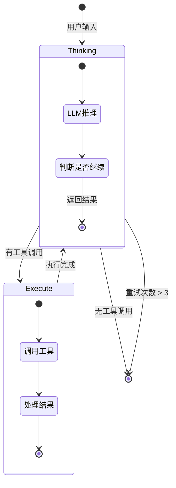
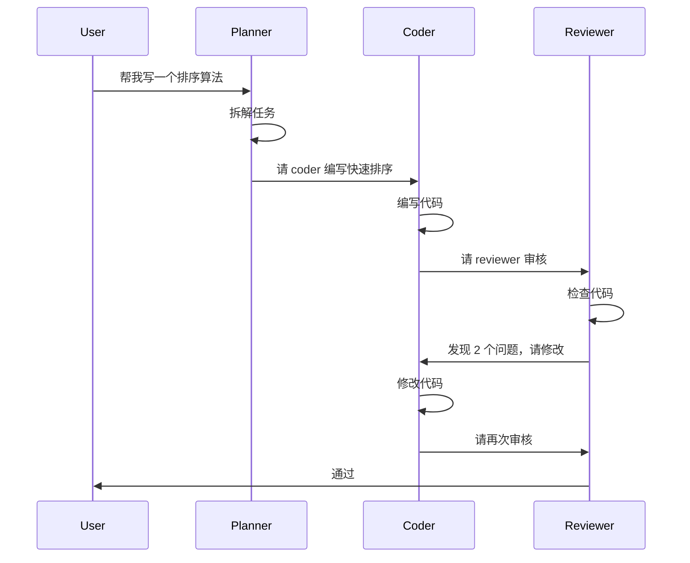
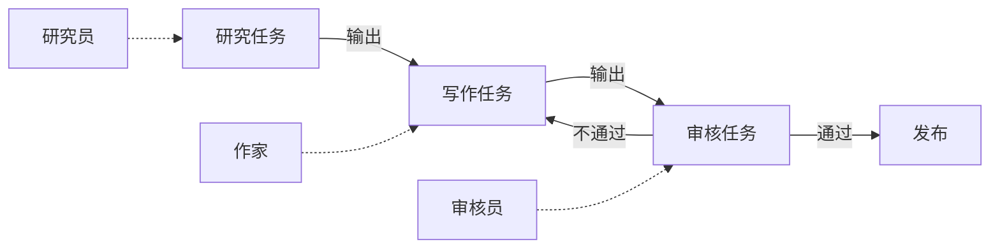

# 主流 Agent 框架对比：从选型到落地

> 四大框架实战踩坑，帮你避开我走过的弯路

## 你的困惑

老板让你做一个 Agent，调研一圈发现框架太多了：LangGraph、AutoGen、CrewAI、Semantic Kernel……

每个框架都在说自己最强。文档看了一堆，Demo 跑了一堆，但就是不知道哪个适合你的场景。

"选错了要重构，成本太高。有没有人能告诉我，这些框架到底有什么区别？"

这篇文章，我把四个主流框架的踩坑经验摊开讲，帮你做决策。

## 框架全景图

### 核心定位对比

| 框架 | 核心理念 | 最适合场景 | 学习曲线 | 生态成熟度 | 生产就绪度 |
|-----|---------|----------|---------|-----------|-----------|
| **LangGraph** | 状态图 + 单 Agent | 单 Agent 复杂流程控制 | 中等 | ⭐⭐⭐⭐⭐ | ✅ 已验证 |
| **AutoGen** | 多 Agent 对话 | 多 Agent 协作任务 | 高 | ⭐⭐⭐⭐ | ✅ 已验证 |
| **CrewAI** | 角色扮演团队 | 多角色协作、任务分配 | 低 | ⭐⭐⭐ | ⚠️ 生态较新 |
| **Semantic Kernel** | 技能插件化 | 企业级集成、微软生态 | 高 | ⭐⭐⭐⭐ | ✅ 已验证 |

### 技术特性矩阵

| 特性 | LangGraph | AutoGen | CrewAI | Semantic Kernel |
|-----|-----------|---------|--------|-----------------|
| **单 Agent 支持** | ✅ 原生 | ✅ 支持 | ✅ 支持 | ✅ 支持 |
| **多 Agent 协作** | ⚠️ 需手动 | ✅ 原生 | ✅ 原生 | ⚠️ 需手动 |
| **状态管理** | ✅ 内置状态图 | ⚠️ 对话状态 | ⚠️ 任务状态 | ✅ 内核状态 |
| **流程控制** | ✅ 图状流程 | ⚠️ 对话驱动 | ❌ 任务顺序 | ✅ 插件编排 |
| **错误处理** | ✅ 节点级别 | ⚠️ 需手动 | ❌ 较弱 | ✅ 内置重试 |
| **循环/重试** | ✅ 原生支持 | ⚠️ max_round | ❌ 不支持 | ✅ 内置 |
| **可观测性** | ✅ checkpoint | ⚠️ 日志 | ❌ 较弱 | ✅ telemetry |
| **工具集成** | ✅ LangChain | ✅ 自定义 | ✅ crewai_tools | ✅ 微软生态 |
| **人类介入** | ⚠️ 需手动 | ✅ UserProxy | ⚠️ 需手动 | ✅ 内置 |
| **企业特性** | ❌ 较少 | ❌ 较少 | ❌ 较少 | ✅ 权限/监控 |

### 性能与成本对比

| 维度 | LangGraph | AutoGen | CrewAI | Semantic Kernel |
|-----|-----------|---------|--------|-----------------|
| **启动速度** | 快 (~50ms) | 中 (~200ms) | 快 (~100ms) | 慢 (~500ms) |
| **内存占用** | 低 | 中 | 中 | 高 |
| **Token 消耗** | 低 | 高（多轮对话） | 中 | 中 |
| **最小示例代码行数** | ~30 行 | ~50 行 | ~20 行 | ~40 行 |
| **典型项目代码量** | 中 | 高 | 低 | 高 |

### 一句话选型建议

```
┌─────────────────────────────────────────────────────────────┐
│  你的需求                                →  推荐框架        │
├─────────────────────────────────────────────────────────────┤
│  单 Agent，流程复杂（循环/重试/分支）    →  LangGraph       │
│  多 Agent 协作，精细控制对话流程        →  AutoGen         │
│  多 Agent 协作，快速原型                →  CrewAI          │
│  企业级应用，微软生态集成               →  Semantic Kernel │
│  简单任务，不需要框架                   →  直接用 LLM API  │
└─────────────────────────────────────────────────────────────┘
```

---

## LangGraph：状态图的魅力

LangGraph 是 LangChain 团队出的，核心理念是"状态图"。

### 架构图：LangGraph 运行时

```
┌────────────────────────────────────────────────────────────────┐
│                      LangGraph Runtime                          │
├────────────────────────────────────────────────────────────────┤
│                                                                 │
│    ┌──────────┐     ┌──────────┐     ┌──────────┐            │
│    │  Input   │────▶│ Thinking │────▶│ Execute  │            │
│    │  Node    │     │   Node   │     │   Node   │            │
│    └──────────┘     └────┬─────┘     └────┬─────┘            │
│                          │                 │                   │
│                          │   ┌─────────────┘                   │
│                          │   │                                 │
│                          ▼   ▼                                 │
│                    ┌──────────────┐                           │
│                    │   Router     │  ← 条件分支                │
│                    │ (条件判断)    │                           │
│                    └──────┬───────┘                           │
│                           │                                    │
│         ┌─────────────────┼─────────────────┐                 │
│         │                 │                 │                  │
│         ▼                 ▼                 ▼                  │
│    ┌─────────┐      ┌─────────┐      ┌─────────┐             │
│    │ Continue│      │  Retry  │      │   End   │             │
│    │  (循环) │      │ (重试)  │      │ (结束)  │             │
│    └────┬────┘      └────┬────┘      └────┬────┘             │
│         │                │                │                   │
│         │                └───────┬────────┘                   │
│         │                        │                            │
│         └────────────▶  ┌────────▼────────┐                  │
│                         │   State Store   │  ← 状态持久化     │
│                         │  (Checkpoint)   │                   │
│                         └─────────────────┘                   │
│                                                                 │
└────────────────────────────────────────────────────────────────┘
```

### 状态流转图



### 为什么需要状态图？

传统 Agent 流程是线性的：

```
用户输入 → 思考 → 执行工具 → 返回结果
```

问题：流程是死的。遇到错误怎么办？需要重试怎么办？需要条件分支怎么办？

LangGraph 用状态图解决：

| 场景 | 传统方式 | LangGraph 方式 |
|-----|---------|---------------|
| 错误重试 | ❌ 手动 try-catch | ✅ 节点级别自动重试 |
| 循环执行 | ❌ 不支持 | ✅ 条件边原生支持 |
| 条件分支 | ⚠️ if-else 堆积 | ✅ Router 节点清晰 |
| 状态追踪 | ❌ 无 | ✅ Checkpoint 持久化 |
| 断点续跑 | ❌ 不可能 | ✅ Time Travel |

### 状态图 vs 链式调用

对比传统 LangChain Chain：

| 维度 | Chain | Graph |
|-----|-------|-------|
| 流程结构 | 线性 `A → B → C` | 图状（有环、有分支） |
| 状态管理 | 无 | ✅ 内置状态传递 |
| 错误处理 | 手动 try-catch | ✅ 节点级别 |
| 循环重试 | ❌ 不支持 | ✅ 原生支持 |
| 可观测性 | 弱 | ✅ 内置 checkpoint |
| 代码复杂度 | 低 | 中 |
| 适用场景 | 简单流程 | 复杂流程 |

### 核心代码实现

```python
from langgraph.graph import StateGraph, END
from typing import TypedDict

# 定义状态
class AgentState(TypedDict):
    messages: list
    tool_calls: list
    errors: list
    retry_count: int

# 定义节点
def thinking_node(state: AgentState) -> AgentState:
    """思考节点：LLM 推理"""
    response = llm.invoke(state["messages"])
    return {**state, "messages": state["messages"] + [response]}

def execute_node(state: AgentState) -> AgentState:
    """执行节点：调用工具"""
    tool_calls = state["messages"][-1].tool_calls
    results = []
    errors = []
    
    for call in tool_calls:
        try:
            result = tools[call["name"]].invoke(call["args"])
            results.append(result)
        except Exception as e:
            errors.append(str(e))
    
    return {
        **state,
        "tool_calls": results,
        "errors": state["errors"] + errors,
        "retry_count": state["retry_count"] + len(errors)
    }

# 构建图
workflow = StateGraph(AgentState)
workflow.add_node("thinking", thinking_node)
workflow.add_node("execute", execute_node)
workflow.set_entry_point("thinking")

# 条件边：根据状态决定下一步
def should_continue(state: AgentState) -> str:
    if state["retry_count"] > 3:
        return "error"
    if state["errors"]:
        return "retry"
    if state["messages"][-1].tool_calls:
        return "execute"
    return "end"

workflow.add_conditional_edges(
    "thinking",
    should_continue,
    {"execute": "execute", "retry": "thinking", "error": END, "end": END}
)
workflow.add_edge("execute", "thinking")

# 编译
app = workflow.compile()
```

### 实战踩坑

**坑 1：状态不可变**

```python
# ❌ 错误：直接修改状态
def bad_node(state: AgentState) -> AgentState:
    state["messages"].append(new_msg)  # 原地修改
    return state

# ✅ 正确：返回新状态
def good_node(state: AgentState) -> AgentState:
    return {
        **state,
        "messages": state["messages"] + [new_msg]
    }
```

**坑 2：忘记设置 entry point**

```python
# ❌ 错误：没有入口点
workflow = StateGraph(State)
workflow.add_node("think", think)
app = workflow.compile()  # 报错：No entry point

# ✅ 正确：设置入口
workflow.set_entry_point("think")
```

**坑 3：条件边返回值不匹配**

```python
# ❌ 错误：返回值不在映射中
def route(state):
    return "unknown"  # 映射中没有这个 key

workflow.add_conditional_edges(
    "think", route, {"execute": "execute"}
)

# ✅ 正确：确保所有返回值都在映射中
workflow.add_conditional_edges(
    "think", route, {"execute": "execute", "unknown": END}
)
```

### LangGraph 适用场景评估

| 场景 | 适用性 | 理由 |
|-----|-------|------|
| 单 Agent，流程复杂 | ✅ 推荐 | 状态图原生支持循环/重试/分支 |
| 需要精确控制每一步 | ✅ 推荐 | 节点级别控制 |
| 需要可观测性 | ✅ 推荐 | Checkpoint + Time Travel |
| 多 Agent 协作 | ❌ 不推荐 | 用 AutoGen 更合适 |
| 简单线性任务 | ⚠️ 过度设计 | 直接用 LLM API |

---

## AutoGen：多 Agent 对话

微软出的，核心理念是"多 Agent 对话"。

### 架构图：AutoGen 多 Agent 协作

```
┌────────────────────────────────────────────────────────────────┐
│                    AutoGen GroupChat                            │
├────────────────────────────────────────────────────────────────┤
│                                                                 │
│    ┌──────────┐                         ┌──────────┐          │
│    │   User   │────────────────────────▶│  Planner │          │
│    │  Proxy   │                         │  Agent   │          │
│    └──────────┘                         └────┬─────┘          │
│         ▲                                    │                 │
│         │                                    ▼                 │
│         │         ┌──────────────────────────────────┐        │
│         │         │                                  │        │
│         │         │      GroupChatManager            │        │
│         │         │      (对话协调器)                 │        │
│         │         │                                  │        │
│         │         └──────────────────────────────────┘        │
│         │                      │                               │
│         │                      ▼                               │
│         │    ┌─────────────────────────────────────┐          │
│         │    │         对话消息队列                 │          │
│         │    │  [msg1, msg2, msg3, ...]           │          │
│         │    └─────────────────────────────────────┘          │
│         │                      │                               │
│         │         ┌────────────┼────────────┐                 │
│         │         │            │            │                  │
│         │         ▼            ▼            ▼                  │
│         │    ┌─────────┐ ┌─────────┐ ┌─────────┐             │
│         │    │  Coder  │ │Reviewer │ │ Tester  │             │
│         │    │  Agent  │ │  Agent  │ │  Agent  │             │
│         │    └─────────┘ └─────────┘ └─────────┘             │
│         │                                                      │
│         └──────────────────────────────────────────────────    │
│                                                                 │
└────────────────────────────────────────────────────────────────┘
```

### 对话流程时序图



### 多 Agent 解决什么问题？

单 Agent 有个局限：所有逻辑都在一个 Prompt 里，容易混乱。

| 问题 | 单 Agent | 多 Agent |
|-----|---------|---------|
| Prompt 膨胀 | ⚠️ 所有逻辑在一起 | ✅ 每个 Agent 专注一个角色 |
| 职责混乱 | ⚠️ 容易跑题 | ✅ 角色明确 |
| 错误传播 | ⚠️ 一错全错 | ✅ 隔离影响 |
| 可扩展性 | ❌ 改动影响全局 | ✅ 增删 Agent 独立 |
| 人类介入 | ⚠️ 难以介入 | ✅ UserProxy 随时接管 |

### 核心代码实现

```python
from autogen import AssistantAgent, UserProxyAgent, GroupChat, GroupChatManager

# 创建多个 Agent
planner = AssistantAgent(
    name="planner",
    system_message="""你是规划专家。
职责：拆解任务、分配给其他 Agent
不要做：写代码、测试
输出格式：JSON 任务列表""",
    llm_config={"model": "gpt-4"}
)

coder = AssistantAgent(
    name="coder",
    system_message="你是代码专家，负责写代码",
    llm_config={"model": "gpt-4"}
)

reviewer = AssistantAgent(
    name="reviewer",
    system_message="你是代码审核专家，负责检查代码质量",
    llm_config={"model": "gpt-4"}
)

# 创建群聊
group_chat = GroupChat(
    agents=[planner, coder, reviewer],
    messages=[],
    max_round=10  # 防止无限循环
)

# 启动对话
manager = GroupChatManager(groupchat=group_chat)
user_proxy = UserProxyAgent("user", code_execution_config=False)
user_proxy.initiate_chat(manager, message="帮我写一个排序算法")
```

### 实战踩坑

**坑 1：无限对话循环**

```
agent_a: "请你做"
agent_b: "请你做"
agent_a: "请你做"
...  # 无限循环
```

```python
# 解决：设置 max_round
group_chat = GroupChat(
    agents=[a, b],
    max_round=10  # 最多 10 轮
)
```

**坑 2：Agent 角色定义不清**

```python
# ❌ 错误：角色模糊
planner = AssistantAgent(
    system_message="你是一个助手"  # 太模糊
)

# ✅ 正确：角色明确（表格化）
```

| 角色属性 | 错误示例 | 正确示例 |
|---------|---------|---------|
| 名称 | "助手" | "规划专家" |
| 职责 | "帮忙" | "拆解任务、分配给其他 Agent" |
| 禁忌 | 无 | "不要写代码、不要测试" |
| 输出格式 | 无 | "JSON 任务列表" |

**坑 3：没有人类干预机制**

```python
# 解决：添加人类代理
user_proxy = UserProxyAgent(
    "user",
    human_input_mode="ALWAYS"  # 每轮都让人类确认
)
```

### AutoGen 适用场景评估

| 场景 | 适用性 | 理由 |
|-----|-------|------|
| 多 Agent 协作 | ✅ 推荐 | 原生支持群聊对话 |
| 规划-执行-审核模式 | ✅ 推荐 | 角色清晰，流程自然 |
| 需要人类参与决策 | ✅ 推荐 | UserProxy 原生支持 |
| 单 Agent 任务 | ❌ 不推荐 | 用 LangGraph 更轻量 |
| 简单对话任务 | ❌ 不推荐 | 直接用 LLM API |

---

## CrewAI：角色扮演团队

CrewAI 比 AutoGen 更高层，核心理念是"角色扮演"。

### 架构对比：AutoGen vs CrewAI

```
┌─────────────────────────────────────────────────────────────────┐
│                         AutoGen 架构                             │
├─────────────────────────────────────────────────────────────────┤
│  ┌─────────┐      ┌─────────┐      ┌─────────┐                │
│  │ Agent A │◀────▶│ Agent B │◀────▶│ Agent C │  ← 对等对话     │
│  └─────────┘      └─────────┘      └─────────┘                │
│       ▲                ▲                ▲                      │
│       └────────────────┴────────────────┘                      │
│                        │                                        │
│              GroupChatManager                                   │
│              (手动管理对话流程)                                  │
└─────────────────────────────────────────────────────────────────┘

┌─────────────────────────────────────────────────────────────────┐
│                         CrewAI 架构                              │
├─────────────────────────────────────────────────────────────────┤
│  ┌─────────┐      ┌─────────┐      ┌─────────┐                │
│  │ Agent A │─────▶│ Agent B │─────▶│ Agent C │  ← 任务链       │
│  └─────────┘      └─────────┘      └─────────┘                │
│       │                │                │                      │
│       └────────────────┴────────────────┘                      │
│                        │                                        │
│                   Crew (自动编排)                               │
└─────────────────────────────────────────────────────────────────┘
```

### 核心概念对比

| 概念 | AutoGen | CrewAI |
|-----|---------|--------|
| Agent 定义 | 手动配置对话行为 | 角色卡片（role/goal/backstory） |
| 任务分配 | 对话中动态分配 | 预定义任务链 |
| 流程控制 | GroupChatManager | Crew 自动编排 |
| 代码量 | 多（~50 行） | 少（~20 行） |
| 灵活性 | 高 | 中 |
| 学习曲线 | 陡峭 | 平缓 |

### 核心代码实现

```python
from crewai import Agent, Task, Crew

# 定义 Agent（像定义角色）
researcher = Agent(
    role="研究员",
    goal="搜索并整理信息",
    backstory="你是资深研究员，擅长搜索和分析",
    tools=[search_tool]
)

writer = Agent(
    role="作家",
    goal="撰写文章",
    backstory="你是技术作家，擅长深入浅出",
)

# 定义任务（像定义工作流）
research_task = Task(
    description="研究 LangGraph 最新特性",
    agent=researcher,
    output_file="research.md"  # 输出保存
)

write_task = Task(
    description="根据研究结果写文章",
    agent=writer,
    context=[research_task]  # 依赖上游任务
)

# 组建团队
crew = Crew(
    agents=[researcher, writer],
    tasks=[research_task, write_task]
)

# 启动
result = crew.kickoff()
```

### 任务链流转图



### 实战踩坑

**坑 1：任务依赖写错**

```python
# ❌ 错误：循环依赖
task_a = Task(context=[task_b])
task_b = Task(context=[task_a])

# ✅ 正确：单向依赖
task_a = Task()
task_b = Task(context=[task_a])
```

**坑 2：角色定义太简单**

| 角色属性 | ❌ 错误示例 | ✅ 正确示例 |
|---------|-----------|-----------|
| role | "助手" | "Python 代码审查专家" |
| goal | "帮忙" | "发现代码中的 bug 和性能问题" |
| backstory | 无 | "你有 10 年 Python 开发经验" |
| tools | 无 | [linter, test_runner] |

### CrewAI 适用场景评估

| 场景 | 适用性 | 理由 |
|-----|-------|------|
| 快速原型 | ✅ 推荐 | 代码量少，上手快 |
| 标准化任务链 | ✅ 推荐 | 研究→写作→审核 |
| 需要精细控制 | ❌ 不推荐 | 自动编排，灵活性低 |
| 非标准协作 | ❌ 不推荐 | 只支持任务链模式 |

---

## Semantic Kernel：企业级集成

微软出的另一个框架，核心理念是"技能插件化"。

### 架构图：Semantic Kernel 插件系统

```
┌────────────────────────────────────────────────────────────────┐
│                    Semantic Kernel                              │
├────────────────────────────────────────────────────────────────┤
│                                                                 │
│  ┌──────────────────────────────────────────────────────────┐  │
│  │                    Kernel Core                            │  │
│  │  ┌────────────┐  ┌────────────┐  ┌────────────┐        │  │
│  │  │ AI Service │  │  Planner   │  │  Memory    │        │  │
│  │  │ (GPT-4)    │  │ (规划器)   │  │ (记忆)     │        │  │
│  │  └────────────┘  └────────────┘  └────────────┘        │  │
│  └──────────────────────────────────────────────────────────┘  │
│                           │                                     │
│                           ▼                                     │
│  ┌──────────────────────────────────────────────────────────┐  │
│  │                   Skills Registry                         │  │
│  │  ┌─────────┐  ┌─────────┐  ┌─────────┐  ┌─────────┐    │  │
│  │  │Calendar │  │  Email  │  │ Search  │  │ Custom  │    │  │
│  │  │ Skill   │  │ Skill   │  │ Skill   │  │ Skill   │    │  │
│  │  └─────────┘  └─────────┘  └─────────┘  └─────────┘    │  │
│  └──────────────────────────────────────────────────────────┘  │
│                           │                                     │
│         ┌─────────────────┼─────────────────┐                 │
│         ▼                 ▼                 ▼                  │
│  ┌─────────────┐   ┌─────────────┐   ┌─────────────┐         │
│  │   Azure     │   │   Teams     │   │  Outlook    │         │
│  │ Integration │   │ Integration │   │ Integration │         │
│  └─────────────┘   └─────────────┘   └─────────────┘         │
│                                                                 │
└────────────────────────────────────────────────────────────────┘
```

### 企业级特性对比

| 特性 | LangGraph | AutoGen | CrewAI | Semantic Kernel |
|-----|-----------|---------|--------|-----------------|
| **权限控制** | ❌ | ❌ | ❌ | ✅ 内置 |
| **审计日志** | ⚠️ 手动 | ⚠️ 手动 | ❌ | ✅ Application Insights |
| **监控告警** | ❌ | ❌ | ❌ | ✅ Telemetry |
| **多租户** | ❌ | ❌ | ❌ | ✅ 内置 |
| **Azure 集成** | ⚠️ 需手动 | ⚠️ 需手动 | ⚠️ 需手动 | ✅ 原生 |
| **Teams 集成** | ❌ | ❌ | ❌ | ✅ 原生 |
| **Outlook 集成** | ❌ | ❌ | ❌ | ✅ 原生 |

### 核心代码实现

```python
import semantic_kernel as sk
from semantic_kernel.connectors.ai.open_ai import OpenAIChatCompletion

# 创建内核
kernel = sk.Kernel()

# 添加 AI 服务
kernel.add_chat_service("gpt-4", OpenAIChatCompletion("gpt-4", api_key))

# 注册技能（插件）
@kernel.skill("calendar")
def schedule_meeting(attendees: str, time: str) -> str:
    """安排会议"""
    return f"已安排 {attendees} 在 {time} 开会"

# 企业级配置
kernel = sk.Kernel(
    log=sk.NullLogger(),
    telemetry=ApplicationInsightsTelemetry()
)

# 权限控制
skill = kernel.skills.get_skill("calendar")
skill.set_permissions(allowed_users=["admin@company.com"])
```

### 实战踩坑

**坑 1：技能签名不标准**

```python
# ❌ 错误：参数没有类型注解
@kernel.skill("bad")
def bad_skill(data):  # 没有类型
    return data

# ✅ 正确：明确类型
@kernel.skill("good")
def good_skill(data: str) -> str:
    return data
```

**坑 2：忘记注册服务**

```python
# ❌ 错误：没有 AI 服务
kernel = sk.Kernel()
result = kernel.run("hello")  # 报错：No AI service

# ✅ 正确：先注册
kernel.add_chat_service("gpt-4", OpenAIChatCompletion(...))
```

### Semantic Kernel 适用场景评估

| 场景 | 适用性 | 理由 |
|-----|-------|------|
| 企业级应用 | ✅ 推荐 | 权限/监控/审计内置 |
| 微软生态集成 | ✅ 推荐 | Azure/Teams/Outlook 原生 |
| 个人项目 | ❌ 不推荐 | 太重，启动慢 |
| 非微软生态 | ❌ 不推荐 | 集成成本高 |

---

## 框架选型决策树

```
                        开始选型
                           │
                           ▼
              ┌────────────────────────┐
              │ 需要多 Agent 协作？     │
              └────────────┬───────────┘
                     │           │
                    是           否
                     │           │
                     ▼           ▼
        ┌──────────────────┐   ┌──────────────────┐
        │ 是企业级应用？    │   │ 流程复杂？        │
        └────────┬─────────┘   └────────┬─────────┘
            │         │            │          │
           是         否           是          否
            │         │            │          │
            ▼         ▼            ▼          ▼
    ┌───────────┐ ┌───────────┐ ┌────────┐ ┌──────────┐
    │ Semantic  │ │ 需要精细  │ │LangGraph│ │ 直接用   │
    │  Kernel   │ │ 控制流程？│ │        │ │ LLM API  │
    └───────────┘ └─────┬─────┘ └────────┘ └──────────┘
                      │      │
                     是      否
                      │      │
                      ▼      ▼
                ┌─────────┐ ┌─────────┐
                │ AutoGen │ │ CrewAI  │
                └─────────┘ └─────────┘
```

## 选型建议速查表

| 你的场景 | 推荐框架 | 备选方案 | 避坑提示 |
|---------|---------|---------|---------|
| 个人项目，快速验证 | 直接用 LLM API | LangGraph | 不要过度设计 |
| 单 Agent，流程有循环/重试 | LangGraph | - | 注意状态不可变 |
| 多 Agent 协作，需要精细控制 | AutoGen | LangGraph + AutoGen | 设置 max_round 防循环 |
| 多 Agent 协作，快速原型 | CrewAI | AutoGen | 角色定义要具体 |
| 企业级应用，微软生态 | Semantic Kernel | - | 启动慢，适合后端 |

## 框架组合使用

实际项目中，框架可以组合使用。

### 组合方案对比

| 组合方案 | 适用场景 | 优势 | 劣势 |
|---------|---------|------|------|
| LangGraph + AutoGen | 主流程用 LangGraph，协作用 AutoGen | 精细控制 + 协作能力 | 代码量增加 |
| CrewAI + LangGraph | 标准任务用 CrewAI，异常处理用 LangGraph | 快速开发 + 健壮性 | 架构复杂 |
| LangGraph + Semantic Kernel | 流程控制用 LangGraph，插件用 SK | 灵活 + 企业特性 | 学习成本高 |

### 示例：LangGraph + AutoGen

```python
from langgraph.graph import StateGraph
from autogen import GroupChat

def multi_agent_step(state):
    """多 Agent 协作步骤"""
    group_chat = GroupChat(agents=[agent_a, agent_b])
    result = group_chat.run(state["input"])
    return {"multi_agent_result": result}

# 主流程用 LangGraph
workflow = StateGraph(State)
workflow.add_node("preprocess", preprocess)
workflow.add_node("multi_agent", multi_agent_step)
workflow.add_node("postprocess", postprocess)
```

---

## 总结：四个框架的核心差异

| 维度 | LangGraph | AutoGen | CrewAI | Semantic Kernel |
|-----|-----------|---------|--------|-----------------|
| **核心抽象** | 状态图 | 多 Agent 对话 | 角色任务 | 技能插件 |
| **最适合** | 单 Agent 复杂流程 | 多 Agent 协作 | 快速原型 | 企业级集成 |
| **学习成本** | 中 | 高 | 低 | 高 |
| **生产就绪** | ✅ | ✅ | ⚠️ | ✅ |
| **代码量** | 中 | 高 | 低 | 高 |
| **灵活性** | 高 | 高 | 中 | 中 |
| **企业特性** | 弱 | 弱 | 弱 | 强 |

## 下一步行动

选定框架后，建议：

1. **先跑通官方示例**（不要直接上生产）
2. **理解核心概念**（LangGraph 的状态、AutoGen 的对话、CrewAI 的角色）
3. **小范围试点**（单功能模块）
4. **踩坑记录**（每个框架都有自己的坑）

---

**相关文章**：
- 用 LangGraph 构建第一个 Agent
- Agent 多 Agent 协作指南
- TypeScript + Python 跨语言架构实践
